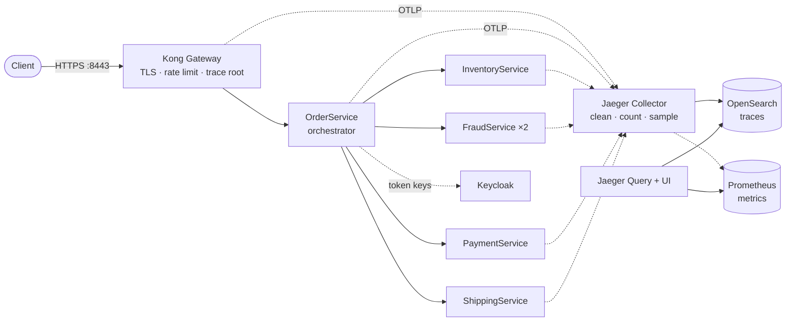

# Kubernetes Distributed Transaction Observability Platform

**A production-shaped platform that runs a distributed order transaction across five .NET
microservices on Kubernetes — and then automatically checks that its traces and metrics tell the
truth about what happened.**

Every experiment in this repository ends with two verdicts:

1. **What the application did** — which requests succeeded, which failed, and what was undone.
2. **Whether the telemetry agrees** — whether the stored traces and metrics describe exactly that,
   with nothing missing, nothing invented and nothing sensitive leaked.

---

## The problem it addresses

Installing distributed tracing is easy. Trusting it is hard. When a dashboard shows a trace, an
operator silently assumes that:

- the trace is **complete** and every span is attached to the right parent,
- a request that was *correctly refused* (for example "insufficient stock") is **not** painted as an
  error,
- requests whose traces were discarded by sampling are **still counted** in the metrics,
- no password, token or card number ended up in a span,
- the trace pipeline itself **survives** outages without silently losing data.

None of these assumptions is checked by a typical setup. This platform checks all of them,
automatically, after every experiment.

## What the platform provides

| Capability | In practice |
| --- | --- |
| A real distributed transaction | Inventory and fraud checks run in parallel, then payment and shipping. Failed steps are undone in reverse order (compensation). |
| End-to-end traces | One trace per request, from the gateway through five services, with pod, node and deployment on every span. |
| A deliberate telemetry pipeline | Noise filtering, secret removal, IP address hashing, tail sampling, and request metrics computed *before* sampling so nothing goes uncounted. |
| Controlled failure experiments | 18 scenarios: slow and failing dependencies, lost replies, pod deletion, rolling restarts, rate limiting, forged tokens, traffic spikes, and outages of the telemetry stack itself. |
| Automated verification | 47 operational checks against the live cluster, plus a telemetry contract for every scenario. |
| One-command lifecycle | `platformctl bootstrap` builds everything from an empty machine; `platformctl destroy` removes it. |

## How it works



*Solid arrows carry the request; dotted arrows carry telemetry.*

1. **Kong Gateway** terminates TLS, enforces rate and size limits, and starts every trace. It
   ignores trace context sent by clients, so nobody outside can influence trace identity.
2. **OrderService** validates the caller's token and drives the order through its steps, retrying
   safely and undoing earlier steps when a later one fails.
3. **The four dependencies** each fail differently — on purpose — so every failure path is
   observable.
4. **The Jaeger Collector** removes noise and secrets, derives request/error/duration metrics from
   *every* span, and only then decides which traces are worth storing.
5. **OpenSearch** stores the kept traces; **Prometheus** stores the metrics; **Jaeger Query** serves
   both through one UI.
6. **`scenarioctl`** injects a fault, sends traffic, restores the platform, and compares the
   application's results with the stored telemetry.

A deeper tour is in [docs/architecture.md](docs/architecture.md).

## Quick start

With the [prerequisites](#prerequisites) installed:

```bash
uv run platformctl preflight          # 1. check Docker resources, tools and free ports
uv run platformctl bootstrap          # 2. create the cluster and deploy everything
uv run platformctl validate           # 3. run 42 checks against the live platform
uv run scenarioctl run payment-retry  # 4. run an experiment and verify its telemetry
uv run platformctl ui jaeger          # 5. browse the traces at http://127.0.0.1:16686
```

Step 2 takes about 14 minutes on a machine with the images already downloaded (15–25 minutes on the
first run) and finishes by running 32 smoke checks. Step 4 prints a verdict like this (shortened):

```text
==> Run 20260918T001359Z-payment-retry-cd2d: PASSED
    requests: 4 {201: 4}; orders read back: 4
...
[ OK ] [application] payment authorizations: 4 orders with exactly 1 authorization(s)
...
[ OK ] [telemetry] retry attempts: 4 trace(s) as expected
[ OK ] [telemetry] idempotent replay: 4 trace(s) as expected
...
```

A guided first hour — sending an order by hand, reading its trace span by span, and running your
first experiment — is in [docs/walkthrough.md](docs/walkthrough.md).

## Verified results

Measured on the local cluster after building it from scratch; all 18 scenarios passed in one
22-minute run.

| Question | Result |
| --- | --- |
| Is a payment charged twice when its reply is lost and the call is retried? | No — exactly **one** authorization per order, and the replay is visible in the trace |
| What happens when a dependency never answers? | 3 attempts, then 504; payment voided and stock released; nothing charged |
| Do customers notice a rolling restart? | No — 240 of 240 orders completed with zero error spans |
| Can traces tell *which replica* is slow? | Yes — slow spans come only from the degraded pod |
| Are rejected requests still counted when their traces are dropped? | Yes — every one of 76 rate-limited requests appeared in the metrics |
| Does the business survive a telemetry outage? | Yes — 40 of 40 orders completed while the Collector was down; the telemetry gap is asserted, not hidden |
| Is trace data lost when storage fails for a minute? | No — all 15 traces arrived after recovery; the retry queue peaked at 12 of 200 batches |

The full catalogue is in [docs/scenario-catalog.md](docs/scenario-catalog.md).

## Technology stack

| Layer | Technology | Role |
| --- | --- | --- |
| Services | .NET 10, ASP.NET Core minimal APIs, Polly | Five microservices with resilience pipelines |
| Instrumentation | OpenTelemetry .NET 1.18 | Traces over OTLP |
| Cluster | Kubernetes 1.36 on kind v0.33 (3 nodes) | Local, reproducible Kubernetes |
| Gateway | Kong Gateway 3.9 (DB-less) + Kong Ingress Controller 3.5, Gateway API v1.3 | TLS, routing, edge policies, trace root |
| Identity | Keycloak 26.7 | OAuth 2.0 client credentials, signed JWTs |
| Trace pipeline | Jaeger 2.21 (OpenTelemetry Collector–based), Collector and Query deployed separately | Filtering, redaction, tail sampling, span metrics |
| Storage | OpenSearch 3.8, Prometheus 3.14 | Traces and metrics |
| Packaging | Helm 4 | Five project charts plus three upstream charts |
| Automation | Python 3.12+ with [uv](https://docs.astral.sh/uv/) | `platformctl` and `scenarioctl` |

Every version is pinned in one file: [deploy/versions.yaml](deploy/versions.yaml).

## Prerequisites

| Tool | Version |
| --- | --- |
| Docker | Running, with at least 4 CPUs and 8 GB of memory available to it (6 CPUs and 10 GB recommended) |
| kind | v0.33.x |
| Helm | v4 |
| kubectl | 1.36 (one minor version either way is accepted) |
| .NET SDK | 10.x |
| Python | 3.12 or newer |
| uv | any recent version |

About 30 GB of free disk space is recommended, and ports `8443` and `9443` on `127.0.0.1` must be
free. The complete setup guide, including verification and cleanup, is
[docs/setup-guide.md](docs/setup-guide.md).

## Everyday commands

```bash
uv run platformctl status                  # nodes, releases, workloads, experiment lock, certificate
uv run platformctl validate                # non-disruptive operational checks
uv run scenarioctl list                    # all experiments
uv run scenarioctl run <scenario>          # run and verify one experiment
uv run scenarioctl reset                   # clean up after an interrupted experiment
uv run platformctl ui prometheus           # metrics at http://127.0.0.1:9090
```

The full command reference is [docs/automation-cli.md](docs/automation-cli.md).

## Testing

```bash
dotnet test               # 151 .NET tests: unit, component and integration
uv run pytest             # 121 Python unit tests, including checks against recorded real traces
uv run pytest -m e2e      # 5 end-to-end tests against the running platform
```

Operational checks (`platformctl validate`) and the 18 scenarios complete the picture. Why each test
lives where it does is explained in [docs/testing-strategy.md](docs/testing-strategy.md).

## Cleaning up

```bash
uv run platformctl destroy           # delete the cluster
uv run platformctl destroy --purge   # also delete the generated local certificate authority
```

`destroy` removes the cluster together with its kubeconfig context. What remains afterwards — images
in Docker's cache, three Helm repository entries, the Python environment and the run records — is
listed with its cleanup command in the
[setup guide](docs/setup-guide.md#what-the-platform-leaves-on-your-machine).

## Limitations

This is a learning and demonstration platform that runs on one workstation. The most important
simplifications, all documented with their production alternatives:

- **In-memory state.** Orders, payments and stock live in memory; a replaced pod starts empty.
- **Plain HTTP inside the cluster.** Services trust the network policies rather than authenticating
  each other.
- **One Collector.** Tail sampling needs every span of a trace in one process, so the Collector is a
  single replica.
- **Spans are lost while the Collector is down.** The services do not buffer them; the
  `collector-outage` scenario asserts this rather than hiding it.
- **A known Kong defect.** Kong 3.9.3 breaks one parent link in the trace of every request that
  fails with a 5xx status; the checks recognise that exact pattern and report it.

See [docs/known-limitations.md](docs/known-limitations.md) and
[docs/production-considerations.md](docs/production-considerations.md).

## Repository layout

```text
.
├── src/            Five .NET services and the shared ServiceDefaults library
├── tests/          .NET unit, component and integration tests
├── automation/     platformctl, scenarioctl and their Python tests
├── deploy/         Helm charts, local values, pinned versions, kind cluster definition
├── scenarios/      The 18 experiment definitions (YAML)
└── docs/           Detailed documentation
```

## Documentation

Start with [docs/README.md](docs/README.md) — it maps common questions to the right document and
suggests reading paths for different goals. The most frequently used documents:

| Document | Answers |
| --- | --- |
| [Walkthrough](docs/walkthrough.md) | What does the platform do, step by step, in the first hour? |
| [Architecture](docs/architecture.md) | What are the parts, and how do a request and its telemetry travel? |
| [Setup guide](docs/setup-guide.md) | How do I install, verify and remove it? |
| [Scenario catalog](docs/scenario-catalog.md) | Which experiments exist, and what did they show? |
| [Telemetry contracts](docs/telemetry-contracts.md) | How is "the telemetry is correct" actually checked? |
| [Design decisions](docs/design-decisions.md) | Why was it built this way, and what does each choice cost? |
| [Troubleshooting](docs/troubleshooting.md) | Something does not work — what now? |
| [Glossary](docs/glossary.md) | What does a term mean? |
