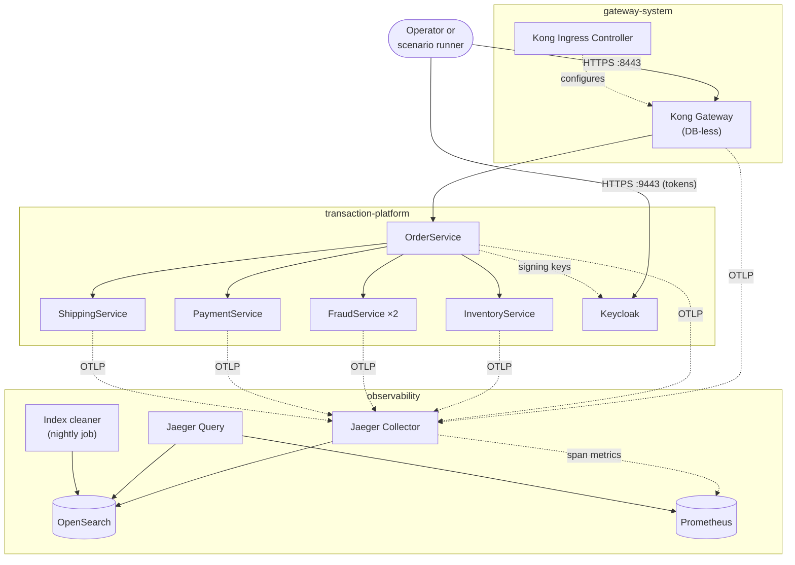
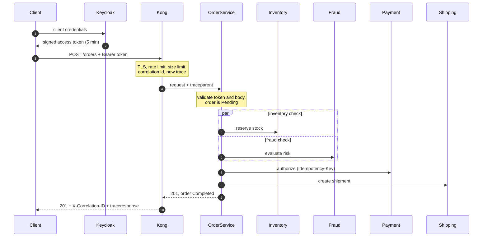
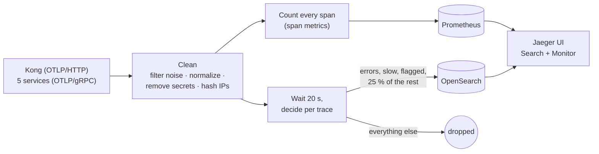
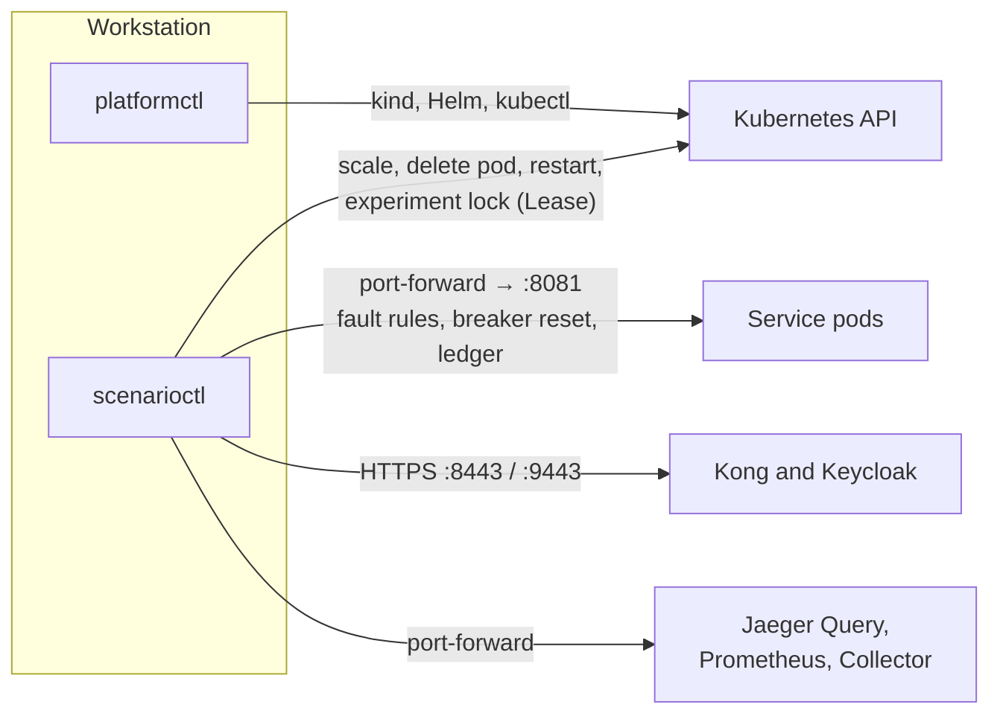

# Architecture

This document describes the platform as a whole: what it is made of, how a request travels through
it, how the request's telemetry travels, and how the automation controls everything. Each area has
its own detailed document, linked where it belongs.

---

## Design goals

Five goals shaped every decision:

1. **Observability that can be trusted.** Traces and metrics must be complete, correctly connected,
   free of secrets, and still correct when parts of the system fail — and this must be *checked*,
   not assumed.
2. **Realistic failure behavior.** The system must fail the way distributed systems fail in
   practice: slow dependencies, lost replies, restarting pods, overloaded edges, broken storage.
3. **Production-shaped, locally.** Real Kubernetes, a real gateway, real identity and a real trace
   store — scaled down to one workstation, with every simplification written down.
4. **Safe experiments.** Breaking the platform on purpose must never leave it broken.
5. **Reproducible from nothing.** One command builds everything; one command removes it.

## The building blocks

| Component | Namespace | Replicas | Responsibility |
| --- | --- | --- | --- |
| Kong Gateway | `gateway-system` | 1 | Terminates TLS, applies rate and size limits, sets the correlation id, starts every trace |
| Kong Ingress Controller | `gateway-system` | 1 | Turns Gateway API resources into Kong configuration |
| OrderService | `transaction-platform` | 1 | Validates requests and tokens; orchestrates the order transaction |
| InventoryService | `transaction-platform` | 1 | Reserves and releases stock |
| FraudService | `transaction-platform` | 2 | Evaluates order risk; stateless, spread across nodes |
| PaymentService | `transaction-platform` | 1 | Authorizes payments exactly once per idempotency key; voids them |
| ShippingService | `transaction-platform` | 1 | Creates shipments for serviceable zones |
| Keycloak | `transaction-platform` | 1 | Issues signed access tokens to API clients |
| Jaeger Collector | `observability` | 1 | Cleans spans, derives metrics, samples traces, writes them to storage |
| Jaeger Query | `observability` | 1 | Serves the trace UI and API, and the Monitor tab |
| OpenSearch | `observability` | 1 | Stores traces in daily indices |
| Prometheus | `observability` | 1 | Stores span metrics and the Collector's own metrics |
| Index cleaner | `observability` | nightly job | Deletes trace indices older than two days |

The services are described individually in [services.md](services.md); the Kubernetes setup in
[kubernetes-platform.md](kubernetes-platform.md).

## Boundaries

The three namespaces are also the three trust zones:

| Namespace | Receives traffic from | Sends traffic to |
| --- | --- | --- |
| `gateway-system` | the workstation (port 8443) | OrderService, the Collector |
| `transaction-platform` | Kong (OrderService only), the workstation (Keycloak's port 9443) | its own services, the Collector |
| `observability` | the services and Kong (OTLP ports only) | nothing outside the namespace |

Every namespace starts with a deny-all network policy; each connection in this table is an explicit
rule, and a validation suite probes them from inside the cluster
([network-policies.md](network-policies.md)). All namespaces enforce the **restricted** Pod Security
Standard ([security.md](security.md)).

Only two ports reach the workstation, both on `127.0.0.1`: the gateway (`8443`) and Keycloak
(`9443`). The Jaeger UI, Prometheus and every service's management port are reached through
`kubectl port-forward` ([operations.md](operations.md)).

## The request path

A client first obtains a token, then places an order. The transaction inside OrderService runs its
four steps — two of them concurrently.

Step by step:

1. **Token (1–2).** The client authenticates with its client id and secret and receives a token that
   names the permissions it holds ([identity-and-tokens.md](identity-and-tokens.md)).
2. **Edge (3–4).** Kong accepts only HTTPS, refuses requests above the rate or size limit, assigns a
   correlation id, starts a new trace and forwards the request ([gateway.md](gateway.md)).
3. **Admission (inside OrderService).** The token's signature, issuer, audience, expiry and
   permission are checked; then the body is validated. Invalid requests end here with 400, 401 or
   403 — before any dependency is called.
4. **Transaction (5–8).** Stock reservation and the fraud check run concurrently; payment starts only
   after both succeeded; shipping comes last. Every call has timeouts, a retry policy and a circuit
   breaker ([resilience.md](resilience.md)).
5. **Result (9–10).** A completed order returns 201. A failed one returns the status that matches its
   failure (422, 502, 503 or 504) after earlier steps were undone
   ([transaction-flow.md](transaction-flow.md)).

## The telemetry path

Every component that handles the request reports spans to the Collector. The Collector processes
each span once and splits the stream in two.

Three properties of this path are central to the project:

- **Counting happens before sampling.** Request rates, error rates and latency histograms include
  every request — also those whose traces were not stored, and those Kong rejected
  ([metrics-and-monitoring.md](metrics-and-monitoring.md)).
- **Sampling happens after the whole trace is known.** The Collector keeps every trace that contains
  an error, lasts a second or more, or was explicitly flagged, plus a quarter of ordinary traffic
  ([sampling.md](sampling.md)).
- **Cleaning happens once, at the front.** Metrics and stored traces see the same attribute names and
  the same redaction ([telemetry-pipeline.md](telemetry-pipeline.md)).

Timing from request to stored trace: spans are exported within a few seconds, the sampling decision
follows 20 seconds after a trace's first span, and the trace is searchable shortly after. The
automation therefore waits 35 seconds before verifying telemetry.

## The control path

The automation runs on the workstation and never needs anything exposed beyond the Kubernetes API.

- **`platformctl`** creates the cluster, deploys the eight components in order, runs the validation
  suites and removes everything again ([automation-cli.md](automation-cli.md)).
- **`scenarioctl`** runs experiments. It sends traffic through the real front door, talks to each
  pod's management port to inject faults, changes workloads through the Kubernetes API, and reads the
  telemetry back through Jaeger Query and Prometheus ([scenario-catalog.md](scenario-catalog.md)).
- A **guard** refuses to run any command against a Kubernetes context other than the local
  `kind-txplatform`, so the tools cannot touch another cluster by accident.

## How the quality goals are achieved

| Goal | Mechanisms | Evidence |
| --- | --- | --- |
| Trustworthy telemetry | Trace root at the edge, baggage allow-list, redaction, metrics before sampling, telemetry contracts | Every scenario's telemetry checks; the `telemetry-pipeline` suite |
| Realistic failures | In-process fault injection, Kubernetes actions, load profiles | 18 scenarios covering application, Kubernetes, edge, security and telemetry failures |
| Resilience | Per-dependency timeouts, retries, circuit breakers, idempotent payments, compensation, graceful shutdown | Rolling restart and pod deletion without failed orders |
| Security | TLS at the edge, signed tokens with permissions, restricted pods, default-deny networking, two-port services | `security` and `foundation` suites, including real connection probes |
| Safe experiments | Experiment lock, write-ahead journal, restore plan, mandatory fault expiry | End-to-end test that kills a run and restores it |
| Reproducibility | Pinned versions, content-hashed images, idempotent deployment | Clean rebuild in 14 minutes; redeployment that restarts nothing |

## Key decisions

Each is explained with its alternatives and costs in [design-decisions.md](design-decisions.md):

- The gateway owns the trace root, so trace identity cannot be influenced from outside.
- Metrics are derived before sampling, so dropped traces are still counted.
- Tail sampling keeps every error, slow and flagged trace, plus a quarter of the rest.
- An explicit orchestrator with compensation, instead of event choreography or two-phase commit.
- Faults are injected inside the services, so one operation, one replica and one experiment can be
  targeted precisely.
- Storage writes are synchronous and retried, so a storage outage delays traces instead of losing
  them.

## What is simplified for local use

Service state lives in memory, traffic inside the cluster is plain HTTP, OpenSearch and Keycloak run
as single instances without production hardening, and the certificate authority is generated
locally. Each simplification, and what would replace it in production, is listed in
[production-considerations.md](production-considerations.md).

## Related documents

- [Services](services.md) — the five services in detail
- [Transaction flow](transaction-flow.md) — states, failure kinds and compensation
- [Telemetry pipeline](telemetry-pipeline.md) — what the Collector does to each span
- [Kubernetes platform](kubernetes-platform.md) — cluster, namespaces and workload settings
- [Design decisions](design-decisions.md) — the reasoning behind this shape
