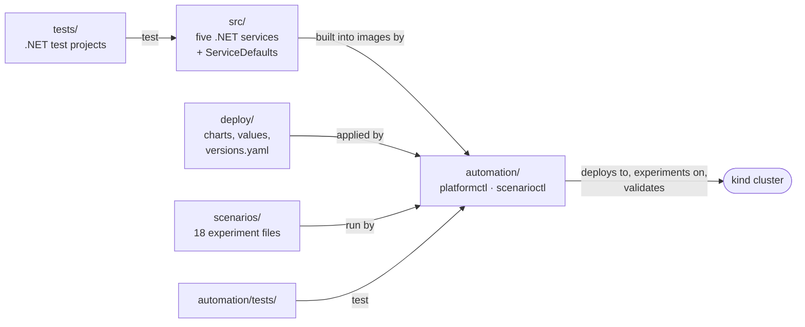

# Codebase guide

This guide is a map of the repository: what each folder contains, how the parts relate, how a
request travels through the code, and which file to open for a given question. It is written for
someone who wants to read, change or extend the platform.

---

## How the parts relate



## Repository layout

```text
.
├── src/                         the five services and their shared library
├── tests/                       .NET unit, component and integration tests
├── automation/
│   ├── src/txplatform/          the automation library behind platformctl and scenarioctl
│   └── tests/                   Python unit tests, end-to-end tests, recorded trace fixtures
├── deploy/                      Helm charts, values files, kind cluster, pinned versions
├── scenarios/                   the experiment definitions, one YAML file each
├── docs/                        this documentation
├── TransactionPlatform.slnx     the .NET solution (src and tests)
├── Directory.Build.props        build settings for every .NET project
├── Directory.Packages.props     central NuGet package versions
├── global.json                  .NET SDK version and test runner
├── pyproject.toml, uv.lock      the Python project and its locked dependencies
├── .editorconfig, .gitattributes  formatting rules; LF line endings everywhere
├── .dockerignore                keeps service image builds limited to the .NET sources
└── CLAUDE.md                    the project's rules for tests, documentation and code comments
```

Folders created locally and ignored by git: `.local/` (certificates), `.runs/` (experiment records),
`.tools/` (optional tool binaries), `.venv/` (the Python environment).

## The .NET services (`src/`)

| Project | Role |
| --- | --- |
| `ServiceDefaults` | Everything every service shares: port separation, health checks, JSON logging, problem details, graceful shutdown, OpenTelemetry setup and naming conventions, the fault framework |
| `OrderService` | The public Order API and the transaction coordinator |
| `InventoryService` | Stock ledger with all-or-nothing, idempotent reservations |
| `FraudService` | Stateless, deterministic risk rules |
| `PaymentService` | Idempotent authorizations, voids and the payment ledger |
| `ShippingService` | Idempotent shipment creation per shipping zone |

Each service follows the same layout:

| Folder | Contains | Depends on |
| --- | --- | --- |
| `Domain/` | Business rules and state — pure code, no HTTP | nothing |
| `Features/` | Endpoints: request handling, mapping results to HTTP answers | `Domain/` |
| `Infrastructure/` | Adapters: outgoing HTTP clients, authentication, telemetry, storage (only where needed) | `Domain/` |
| `Program.cs` | Wiring: a short file that combines ServiceDefaults with the service's features | everything |

Keeping the rules in `Domain/` free of HTTP is what lets most behavior be unit-tested without a
host ([testing-strategy.md](testing-strategy.md)).

### A request through the code

Following `POST /orders` from the gateway to a dependency:

| Step | File |
| --- | --- |
| 1. Shared middleware: port separation, problem details, health, tracing | `src/ServiceDefaults/ServiceDefaultsExtensions.cs`, `Hosting/PortSeparation.cs` |
| 2. Trust boundary: validated correlation and scenario ids, `traceresponse` header | `src/OrderService/Infrastructure/Telemetry/CorrelationBoundary.cs` |
| 3. Token validation and permissions | `src/OrderService/Infrastructure/Auth/OrderAuthentication.cs` |
| 4. The endpoint and the mapping of outcomes to HTTP statuses | `src/OrderService/Features/OrderEndpoints.cs` |
| 5. Request validation | `src/OrderService/Features/CreateOrder/CreateOrderValidator.cs` |
| 6. The transaction: parallel checks, payment, shipping, compensation | `src/OrderService/Features/CreateOrder/OrderTransactionCoordinator.cs` |
| 7. States and allowed transitions | `src/OrderService/Domain/OrderStateMachine.cs`, `OrderState.cs` |
| 8. Calling a dependency: stage span, resilience pipeline, result classification | `src/OrderService/Infrastructure/Dependencies/Gateways.cs` |
| 9. Timeouts, retries and circuit breakers per dependency | `src/OrderService/Infrastructure/Dependencies/DependencyPolicies.cs` |
| 10. The dependency's endpoint, with its fault checkpoints | for example `src/PaymentService/Features/PaymentEndpoints.cs` |
| 11. Business spans and events | `src/OrderService/Infrastructure/Telemetry/OrderTelemetry.cs` |

## The automation (`automation/src/txplatform/`)

### Platform lifecycle

| Module | Responsibility |
| --- | --- |
| `platform_cli.py` | The `platformctl` command line |
| `lifecycle.py` | The eight deployment components and their order |
| `versions.py`, `paths.py` | The version manifest and repository paths |
| `tools.py` | Running external programs, including stopping whole process trees |
| `kube.py` | Kubernetes clients pinned to the project context, the context guard, wait helpers |
| `kind.py`, `helm.py` | Cluster creation; Helm releases, including recovery of interrupted ones |
| `images.py` | Content-hash image tags and builds |
| `pki.py`, `secrets.py` | The local CA and certificates; generated secrets |
| `preflight.py`, `status.py`, `console.py` | Workstation checks, the status overview, output formatting |
| `portforward.py` | Temporary local access to cluster-internal ports |
| `probes.py` | Short-lived probe pods that test connections from inside the cluster |
| `runlock.py` | The experiment lock (a Kubernetes Lease) |

### Talking to the platform

| Module | Responsibility |
| --- | --- |
| `identity.py`, `orders.py` | Tokens from Keycloak; order requests through the gateway |
| `jaeger.py`, `traces.py` | The Jaeger API client and the typed trace model the checks use |
| `prometheus.py` | PromQL queries and metric selectors |
| `otlp.py` | Sending synthetic spans to the Collector |
| `stats.py` | Statistical tolerance bands for sampling checks |

### Scenarios (`scenarios/` subpackage)

| Module | Responsibility |
| --- | --- |
| `schema.py`, `catalog.py` | The scenario file format with strict validation; loading `scenarios/*.yaml` |
| `engine.py` | One run from start to finish: lock, pre-flight, faults, traffic, restoration, checks |
| `workload.py` | Open-loop traffic generation and order templates |
| `control.py` | Operator actions: fault rules, circuit breakers, the payment ledger, Kubernetes changes |
| `journal.py`, `records.py` | The write-ahead journal with its restore plan; the run record on disk |
| `expectations.py` | Application expectations: statuses, states, compensation, authorizations |
| `tracechecks.py`, `contracts.py` | Reusable pure trace checks; one telemetry contract per scenario |
| `scenario_cli.py` (package root) | The `scenarioctl` command line |

### Validation (`validation/` subpackage)

`framework.py` runs suites and reports results; `suites.py` registers them; one module per suite:
`foundation`, `security`, `tracing`, `edge`, `observability`, `telemetry_pipeline`,
`observability_resilience`, `recovery` ([validation-suites.md](validation-suites.md)).

## Deployment (`deploy/`)

| Path | Contents |
| --- | --- |
| `versions.yaml` | Every pinned tool, chart and image version, and the node image digest |
| `kind/cluster.yaml` | The cluster: three nodes and two loopback port mappings |
| `crds/` | The Gateway API resource definitions |
| `charts/platform-foundation` | Namespaces, Pod Security labels, LimitRanges, deny-all and DNS policies |
| `charts/gateway` | GatewayClass, Gateway, Kong's global tracing plugin, gateway network policies |
| `charts/identity` | Keycloak, the realm file, its network policy |
| `charts/observability` | Jaeger Collector and Query, their configuration (`_configs.tpl`), the retention CronJob, network policies |
| `charts/transaction-services` | The five services, their Services, seed data, network policies, the HTTPRoute and edge plugins |
| `values/local/` | Local values for the services and for the upstream Kong, OpenSearch and Prometheus charts |

Details of each setting: [configuration-reference.md](configuration-reference.md).

## Tests

| Path | Layer |
| --- | --- |
| `tests/Platform.UnitTests` | Pure .NET logic, grouped by area (`Defaults`, `Orders`, `Payments`, `Services`) |
| `tests/Platform.ComponentTests` | One service in memory with its real HTTP pipeline |
| `tests/Platform.IntegrationTests` | All services over real HTTP; Keycloak in a container |
| `tests/Platform.TestSupport` | Shared helpers: in-process service host, test orders, tokens, repository files |
| `automation/tests/unit` | Automation logic and the trace checks |
| `automation/tests/e2e` | Critical journeys, the negative control and experiment safety, against the running platform |
| `automation/tests/fixtures/traces` | Traces recorded from real runs, used by the trace-check tests |

## Finding your way

| Question | Open |
| --- | --- |
| Which states can an order have? | `src/OrderService/Domain/OrderState.cs`, `OrderStateMachine.cs` |
| Which failure wins, and what is undone? | `src/OrderService/Domain/TransactionRules.cs` |
| Why was a call retried, or not? | `src/OrderService/Infrastructure/Dependencies/DependencyPolicies.cs` |
| What does a span attribute or event mean? | `src/ServiceDefaults/Telemetry/TelemetryConventions.cs` |
| What is never recorded on a span? | `src/ServiceDefaults/Telemetry/PlatformTelemetry.cs` |
| How does a fault rule work? | `src/ServiceDefaults/Faults/` |
| What does the Collector do with a span? | `deploy/charts/observability/templates/_configs.tpl` |
| Which connections are allowed? | `deploy/charts/*/templates/network-polic*.yaml` |
| What exactly does a scenario check? | `scenarios/<id>.yaml` and `automation/src/txplatform/scenarios/contracts.py` |
| What does `platformctl validate` check? | `automation/src/txplatform/validation/` |

## Conventions

- **Every important file explains itself.** A short comment at the top says why the file exists and
  how it fits in; comments elsewhere explain reasons, not mechanics.
- **Names are defined once.** Attribute, event and baggage names live in `TelemetryConventions.cs`
  for the services; the checks in `tracechecks.py` use the same names.
- **Versions are defined once.** Nothing hard-codes a version that belongs in
  `deploy/versions.yaml`, `Directory.Packages.props`, `global.json` or `uv.lock`.
- **Warnings are errors** in the .NET build (`Directory.Build.props`), and nullable reference types
  are enabled everywhere.
- **Line endings are LF** in every file (`.gitattributes`), so images built on Windows and Linux get
  the same content hash.
- **Logic is tested where it lives.** Any Python module with real decisions has unit tests; any .NET
  rule lives in `Domain/` where it can be tested without a host.

## Related documents

- [Architecture](architecture.md) — the system these files implement
- [Services](services.md) — what each service does
- [Testing strategy](testing-strategy.md) — how the test projects divide the work
- [Automation CLI](automation-cli.md) — the commands built on the automation library
