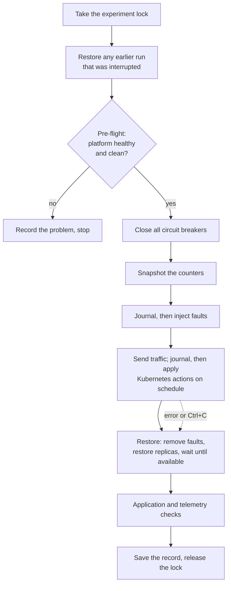

# Experiment safety

Experiments deliberately break things: they inject faults, delete pods and scale components to zero.
This document describes the mechanisms that keep those experiments from damaging the platform, from
interfering with each other, and from ever reaching a cluster they were not meant for — and how the
platform is restored even when an experiment crashes halfway.

---

## Safeguards at a glance

| Risk | Safeguard |
| --- | --- |
| An experiment runs against the wrong cluster | Every Kubernetes call is pinned to the `kind-txplatform` context, and a guard refuses to act unless that context points at a local API server |
| Two experiments overlap and spoil each other's measurements | A cluster-wide lock admits one experiment, validation or deployment at a time |
| A crash leaves a fault or a scaled-down component behind | A write-ahead journal records each change before it is made, and restoration replays it |
| A fault outlives everything, even the journal | Every fault rule expires on its own |
| An experiment starts on a broken or dirty platform | A pre-flight check refuses to start |
| One experiment's open circuit breaker affects the next | Circuit breakers are closed before every run |

## The lifecycle of a run



Restoration happens **before** the results are checked, so a failing check can never leave the
platform degraded, and it also runs after errors and interruptions.

## The context guard

The automation never uses kubectl's "current context". Every call — through the Kubernetes client
library, `kubectl` or `helm` — names the context `kind-txplatform` explicitly. Before the first
call, a guard reads that context's API server address and refuses to continue unless it is a
loopback address (`127.0.0.1`, `localhost` or `::1`), which is what kind creates:

```text
ContextGuardError: context 'kind-txplatform' points at 'https://10.0.0.5:6443', which is not a local kind cluster
```

Switching contexts in another terminal, or a kubeconfig that happens to contain a context of the
same name for a remote cluster, can therefore never redirect an experiment to a real cluster.

## One experiment at a time

Several checks compare exact numbers — "76 requests were rejected, so the metric must have grown by
exactly 76". Such checks are only valid if nothing else sends traffic at the same time. The platform
therefore uses a **lock**, implemented as a Kubernetes **Lease** (a small object designed for exactly
this purpose: one holder at a time, with an expiry).

| Property | Value |
| --- | --- |
| Object | Lease `txplatform-experiment-lock` in `transaction-platform` |
| Taken by | `scenarioctl run`, `platformctl validate`, `platformctl deploy` and `platformctl bootstrap` |
| Holder | Host name and process id of the holder, plus a readable purpose (for example `scenario payment-retry (…)`) |
| Renewal | Every 20 seconds while the holder runs |
| Expiry | 90 seconds after the last renewal — a crashed holder's lock frees itself |

A second experiment is refused with a message that says who holds the lock:

```text
[FAIL] LockHeldError: 'scenario rolling-restart (20260918T…)' holds the experiment lock (<host>/12345, renewed 10:42:07 UTC)
```

`uv run platformctl status` shows whether the lock is free. `uv run scenarioctl reset --force`
releases a lock held by another process, for the rare case that its holder is known to be gone and
waiting 90 seconds is not an option.

## The journal: write first, then act

Each run keeps a journal at `.runs/<run id>/journal.jsonl`. Every change is appended — and flushed to
disk — **before** it is made:

```json
{"kind": "fault", "service": "payment-service", "pod": "payment-service-565cfb8955-vplc2", "operation": "payment.authorize", "mode": "latency"}
{"kind": "scale", "workload": "shipping-service", "originalReplicas": 1, "replicas": 0}
```

If the process dies at any moment, the journal lists everything that may have happened. The
**restore plan** is derived from the journal alone, in a fixed, safe order:

| Order | Step | Reason |
| --- | --- | --- |
| 1 | Remove all fault rules from every service that had one | Faults stop affecting traffic first |
| 2 | Restore each scaled workload to its **original** replica count | The first journaled count is the original; later scale actions cannot overwrite it |
| 3 | Wait until every touched workload is available again | Includes workloads that only had a fault: a pod that lost its readiness needs a moment to report ready again |

Every step can be repeated safely: removing faults that are already gone, or scaling to a count that
is already set, changes nothing. A run is marked `restored` only after all steps succeeded.

## Recovering from a crash

| Situation | What happens |
| --- | --- |
| The run fails with an error | Restoration runs in the `finally` block; the record's status is `error` |
| The operator presses Ctrl+C | Restoration runs; the status is `interrupted` |
| The process is killed hard (no cleanup code runs) | The record stays `restored: false`. The **next** `scenarioctl run` restores it before doing anything else; `scenarioctl reset` does so immediately |

`scenarioctl reset` brings the platform back to a clean state in one command:

```bash
uv run scenarioctl reset
```

```text
[ OK ] restored interrupted run 20260918T…-payment-timeout-…
[ OK ] closed all circuit breakers
```

It finishes the restoration of every interrupted run, removes any fault rule still present in any
pod, and closes all circuit breakers.

This path is tested for real: an end-to-end test starts `dependency-unavailable`, waits until
ShippingService has been scaled to zero, kills the process without warning, and then asserts that
`scenarioctl reset` restores the replica count, that the service becomes available again, and that
the lock is free ([testing-strategy.md](testing-strategy.md)).

## Faults expire on their own

The journal protects against a crashed runner. As a last line of defence, every fault rule also has a
mandatory lifetime — at most 30 minutes in a scenario file, typically 3 to 5 — after which the
service discards it by itself. Even if the runner, its journal and the operator all failed, a fault
could not remain active ([fault-injection.md](fault-injection.md)).

## Pre-flight: refuse to start on a bad platform

A run that starts on a broken or dirty platform would measure the wrong thing. Before injecting
anything, the runner checks that:

- every service, Keycloak, Kong, the Collector, Query, Prometheus and OpenSearch are available;
- the gateway answers an unauthenticated request with 401 (routing and authentication work);
- a token can be obtained from Keycloak;
- no fault rule is left in any pod.

If any check fails, the run is recorded with status `error` and the reason, and nothing is changed.

## Related documents

- [Fault injection](fault-injection.md) — fault rules and their expiry
- [Automation CLI](automation-cli.md) — `scenarioctl` and `platformctl` commands
- [Troubleshooting](troubleshooting.md) — what to do when a run was interrupted
- [Security](security.md) — the context guard in the wider security picture
