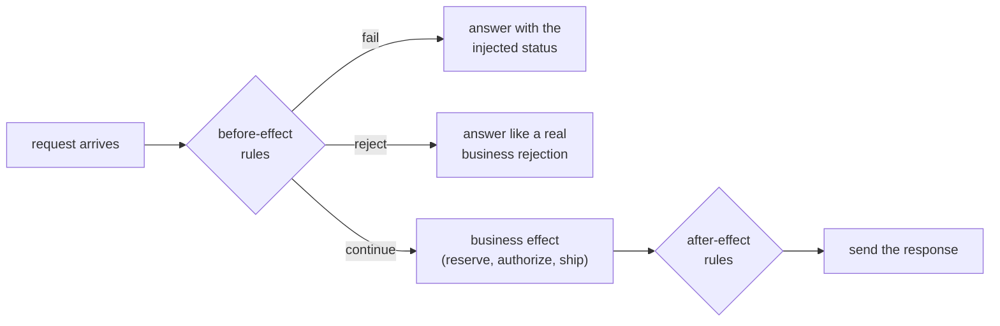

# Fault injection

To observe how failures look in telemetry, the platform must be able to cause them on demand. Faults
are injected **inside the services**, at exactly defined points in their request handling. This
makes them precise — one operation, one replica, one experiment — and every fault expires on its own.
This document describes the fault modes, how a fault rule is scoped and applied, and how injected
behavior is marked in traces.

---

## Why inside the services

Faults could also be injected from outside, by a proxy or a service mesh that delays or breaks
network traffic. The platform injects them in the application instead:

| Aspect | Network-level injection | In-service injection (this platform) |
| --- | --- | --- |
| Precision | Whole connections or routes | One named operation, before or after its business effect |
| Lost-reply simulation | Impossible to delay only the reply of a request that already took effect | Built in (`after-effect` phase) |
| Business outcomes | Cannot produce a realistic "insufficient stock" | Can answer exactly like the real business rule |
| Visibility | The trace shows a slow call, with no hint that it was simulated | The span that applied the fault says so |
| Extra infrastructure | A mesh or proxy | None |

The trade-off: the services contain code that exists only for experiments. It is switched off by
default and reachable only through the management port ([security.md](security.md)).

## Where a fault can apply

Each dependency asks its fault injector for a decision at two points in the handler:



| Phase | What has happened when the fault applies | Typical use |
| --- | --- | --- |
| `before-effect` (default) | Nothing — the caller sees a failure and no work was done | Errors, timeouts, rejections, slowness |
| `after-effect` | The effect is recorded; only the reply is late | A **lost reply**: the caller gives up and retries although the work was done — the situation the `payment-retry` scenario tests ([resilience.md](resilience.md)) |

Operations that accept fault rules:

| Service | Operations |
| --- | --- |
| InventoryService | `inventory.reserve`, `inventory.release`, `readiness` |
| FraudService | `fraud.evaluate`, `readiness` |
| PaymentService | `payment.authorize`, `payment.void`, `readiness` |
| ShippingService | `shipping.create`, `readiness` |

OrderService has no fault operations: it is the component under observation, and its behavior is
changed only through its dependencies.

## Fault modes

| Mode | Effect | Required fields |
| --- | --- | --- |
| `latency` | Waits before continuing normally | `delayMs` |
| `http-error` | Answers with the given status instead of doing the work | `statusCode` |
| `timeout` | Holds the request until the caller gives up; answers 504 if nobody does (after `delayMs`, default 60 s) | – |
| `intermittent` | Fails the first *N* attempts per key (`failAttempts`), or every *N*th request (`everyNth`) | `statusCode` and exactly one of `failAttempts` / `everyNth` |
| `business-rejection` | Answers like the real business rule: insufficient stock, fraud rejection (score 99), declined payment, or zone not serviceable | – |
| `readiness-loss` | Makes the pod's readiness check fail while it keeps serving and stays alive | operation `readiness` |

Two modes deserve a closer look:

- **`intermittent` is deterministic, not random.** For a payment, the key is the request's
  idempotency key, so "fail the first attempt" means exactly one failure per order, followed by a
  successful retry. Repeating a scenario therefore produces the same result every time.
- **`readiness-loss` changes no answer.** Kubernetes sees a failing readiness probe and removes the
  pod from the Service endpoints, while the liveness probe keeps passing, so the pod is not
  restarted. The `readiness-loss` scenario uses it to watch traffic move away from a running pod.

## A fault rule

Rules are sent to one pod's management port. The fields:

| Field | Meaning |
| --- | --- |
| `operation`, `mode` | What is affected and how; unknown operations are rejected |
| `ttlSeconds` | **Required.** The rule expires after this time (1 to 3 600 seconds in the service) |
| `delayMs`, `statusCode`, `failAttempts`, `everyNth` | Mode parameters (delay 1–120 000 ms; status 400–599) |
| `phase` | `before-effect` (default) or `after-effect` (latency only) |
| `scenarioRunId` | If set, only requests carrying this run id in their baggage are affected |
| `maxActivations` | The rule stops after this many applications |

Trying it by hand (PaymentService has a single replica, so the deployment's pod is the only one):

```bash
kubectl -n transaction-platform port-forward deploy/payment-service 8081:8081
```

In a second terminal:

```bash
# Delay every payment authorization by 1.2 s for the next two minutes
curl -s -X PUT http://127.0.0.1:8081/internal/faults \
  -H 'Content-Type: application/json' \
  -d '{"operation":"payment.authorize","mode":"latency","delayMs":1200,"ttlSeconds":120}'

curl -s http://127.0.0.1:8081/internal/faults              # list active rules
curl -s -X DELETE http://127.0.0.1:8081/internal/faults    # remove all rules → {"removed":1}
```

An invalid rule is refused with every problem listed:

```json
{
  "title": "Invalid fault rule",
  "status": 400,
  "errors": {
    "ttlSeconds": ["must be between 1 and 3600 seconds so every fault expires"],
    "operation": ["unknown operation; known operations: payment.authorize, payment.void"],
    "delayMs": ["is required for latency faults"]
  }
}
```

In normal use the scenario runner creates and removes rules; manual rules are for exploration.

## Safety properties

| Property | How it is achieved | Why it matters |
| --- | --- | --- |
| **Every fault expires** | `ttlSeconds` is mandatory; scenario files allow at most 1 800 seconds | A crashed or interrupted experiment cannot leave a fault behind forever |
| **Faults can be limited to one experiment** | Scenario faults are scoped by default: only requests with the run's id in baggage are affected | Other traffic through the same pods is untouched |
| **Faults can target one replica** | Rules are applied per pod through `pod/<name>` port-forwards, never through a Service; a scenario chooses `replicas: all` or `one` | Makes replica-specific degradation observable (`replica-degradation`) |
| **Nothing is left behind** | The runner journals every rule before creating it and removes all rules during restoration; the next run refuses to start while any rule remains | See [experiment-safety.md](experiment-safety.md) |
| **Off unless enabled** | `faults.enabled` is `false` in the chart defaults and `true` only in the local values file; when off, the `/internal/faults` endpoints do not exist | A production deployment cannot be degraded by accident |

A readiness fault affects a whole pod, not individual requests, so it cannot be scoped to a run; the
scenario schema requires `scoped: false` for it.

## Injected behavior is always visible

When a fault changes a request, the span that handled it records:

| Attribute or event | Value |
| --- | --- |
| `failure.injected` | `true` |
| `simulation.mode` | the fault mode, for example `latency` |
| `fault.rule.id` | the id of the rule that applied |
| event `fault.applied` | `fault.mode`, `fault.phase`, `fault.outcome`, `fault.delay_ms`, `fault.status_code` |

An operator reading a trace, and every automated check, can therefore tell a simulated failure from a
real one. An integration test also verifies that **only** the targeted operation is marked: when
payment authorization fails through an injected 503, all three authorization attempts carry
`failure.injected`, while the compensating void call that follows does not
([testing-strategy.md](testing-strategy.md)).

## Related documents

- [Scenario catalog](scenario-catalog.md) — which experiments use which faults
- [Writing scenarios](writing-scenarios.md) — declaring faults in a scenario file
- [Experiment safety](experiment-safety.md) — journaling, restoration and expiry
- [Resilience](resilience.md) — how OrderService reacts to the injected failures
