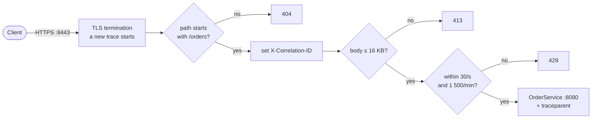

# Gateway

Kong Gateway is the only way into the platform. It terminates TLS, protects OrderService from
excessive and oversized traffic, gives every request a correlation id, and starts every trace. This
document describes how the gateway is configured, what it enforces, and one known defect in its
tracing.

---

## What the gateway does to a request

Everything in this diagram happens before OrderService sees the request. Requests rejected with 413
or 429 never reach the application, yet each one still produces a Kong span — and because the
Collector turns every span into metrics, every rejection is counted even though most of their traces
are not stored ([metrics-and-monitoring.md](metrics-and-monitoring.md)). The correlation-id plugin
runs first, so rejected requests carry a correlation id too.

## How Kong is configured

Kong runs **DB-less**: it has no database of its own. The Kong Ingress Controller watches Kubernetes
resources and pushes the resulting configuration to Kong. Nothing is configured through Kong's admin
API by hand, and neither the admin API nor Kong's web UI (Kong Manager) is exposed — Kong Manager is
switched off entirely, and a security check fails if any unexpected port becomes reachable from
outside the cluster.

Routing uses the Kubernetes **Gateway API**, the standard successor to `Ingress`:

| Resource | Namespace | Owned by | Contents |
| --- | --- | --- | --- |
| `GatewayClass kong` | cluster-wide | platform | Declares Kong as the implementation |
| `Gateway platform-gateway` | `gateway-system` | platform | One HTTPS listener on port 443 with the `edge-tls` certificate; accepts routes only from namespaces labelled `txplatform.io/gateway-access=true` |
| `HTTPRoute order-api` | `transaction-platform` | application | Path prefix `/orders` → Service `order-service`, port 8080 |

This split mirrors how responsibilities divide in a real organisation: the platform decides *how*
traffic enters (listener, certificate, who may attach routes), the application decides *what* it
exposes. A route created in a namespace without the access label is rejected by the Gateway — the
edge validation suite creates one and checks that it never becomes active.

Outside the cluster, Kong's proxy is reachable through a NodePort (30443) that kind maps to
`127.0.0.1:8443`. There is no plaintext HTTP listener at all.

## Edge policies

Three Kong plugins are attached to the route:

| Plugin | Configuration | Effect |
| --- | --- | --- |
| `correlation-id` | header `X-Correlation-ID`, generator UUID, echoed to the client | Every request carries an id an operator can search for |
| `rate-limiting` | 30 per second and 1 500 per minute, per client IP, counted locally in Kong | Excess requests get 429 with `RateLimit-*` headers |
| `request-size-limiting` | 16 KB | Oversized bodies get 413 |

**Why per-pod counting.** The `local` policy counts inside each Kong pod. With one Kong replica this
is exact and needs no Redis or database; with several replicas each would count separately
([production-considerations.md](production-considerations.md)).

Two upstream settings are applied through annotations on the `order-service` Service:

| Setting | Value | Reason |
| --- | --- | --- |
| Retries | **0** | Kong must not turn one `POST /orders` into two orders. Retrying is OrderService's job, where idempotency keys make it safe ([resilience.md](resilience.md)) |
| Upstream timeout | 15 s | Longer than OrderService's 12-second transaction budget, so OrderService — not Kong — decides when an order has failed |

Kong's response headers are limited to `X-Kong-Request-Id` and latency information; the Kong version
is not advertised.

## TLS

The listener terminates TLS 1.3 with a server certificate for `localhost`, issued by a certificate
authority that the automation generates into `.local/pki` and stores in the Kubernetes secret
`edge-tls`. Clients trust it by using `.local/pki/ca.crt` (for example `curl --cacert`). Inside the
cluster, traffic from Kong to OrderService is plain HTTP — a deliberate local simplification
([security.md](security.md)).

## Forwarded request information

OrderService builds absolute URLs, such as the `Location` header of a new order, from the original
scheme and host. It must learn them from Kong's `X-Forwarded-*` headers, but must not believe such
headers from anyone else. It therefore trusts forwarded headers only from the cluster's pod network
(`10.244.0.0/16`): a client that sends `X-Forwarded-Proto: http` from outside is ignored, while
Kong's values are used. The edge suite checks both cases.

## Kong starts every trace

A global OpenTelemetry plugin makes Kong report two spans for every request — `kong` (the request)
and `kong.balancer` (the call to the upstream) — over OTLP/HTTP to the Collector. It is configured to
**never continue a trace sent by a client**:

| Plugin setting | Value | Effect |
| --- | --- | --- |
| `propagation.extract` | *(empty)* | Incoming `traceparent` headers are ignored |
| `propagation.clear` | `tracestate`, `baggage` | These client headers are removed before forwarding |
| `propagation.inject` | `w3c` | A fresh `traceparent` is sent to OrderService |
| Sampling rate | 1.0 | Kong reports every request; the Collector decides what to keep |

**Why.** If clients could choose trace ids, they could attach their requests to someone else's trace,
collide with existing ids, or flag their own traffic to force it into storage. Because Kong decides,
every trace in the platform has exactly one origin — the gateway — and the edge suite verifies that a
client-supplied `traceparent` is ignored.

Kong's spans carry the resource attributes `service.name=kong-gateway`, `service.version=3.9.3`,
`service.namespace=txplatform`, the environment, and the Kubernetes namespace and deployment. They do
not carry a pod name, because the plugin's configuration is static and cannot know which pod it runs
in.

## Known defect: a missing parent span on 5xx responses

When OrderService answers with a status of 500 or above, Kong 3.9.3 marks its call as failed and
then exports a **new** `kong.balancer` span, instead of the one whose id it had already sent to
OrderService in `traceparent`. OrderService's span therefore refers to a parent that is never
exported, and the trace shows a gap between the gateway and the application.

The defect is in Kong's own code (`kong/runloop/handler.lua` marks the try as failed;
`kong/observability/tracing/instrumentation.lua` then starts a new span). It affects every failed
order — 502, 503 and 504 — and nothing else. The platform's trace checks recognise exactly this
pattern and report it as a visible note on the run, while any other missing parent still fails
([known-limitations.md](known-limitations.md)).

## What is verified

The `edge` validation suite checks, against the running platform:

- the Gateway and HTTPRoute are accepted and programmed;
- HTTPS uses TLS 1.2 or newer with the local CA certificate, and no plaintext listener exists;
- only `/orders` is routed, and it reaches OrderService's authentication;
- a route from a namespace without gateway access is rejected;
- correlation ids are generated when absent and preserved when valid;
- `Location` headers use the public HTTPS address, and spoofed forwarding headers are ignored;
- Kong never retries order requests;
- Kong starts every trace and ignores client trace context;
- Kong's network policies allow only its intended connections.

Rate limiting and body size limits are exercised by the `kong-rate-limit` and `oversized-request`
scenarios ([scenario-catalog.md](scenario-catalog.md)).

## Related documents

- [Security](security.md) — trust boundaries and TLS
- [Tracing](tracing.md) — what happens to the trace after Kong
- [Network policies](network-policies.md) — Kong's allowed connections
- [Known limitations](known-limitations.md) — the Kong tracing defect in context
