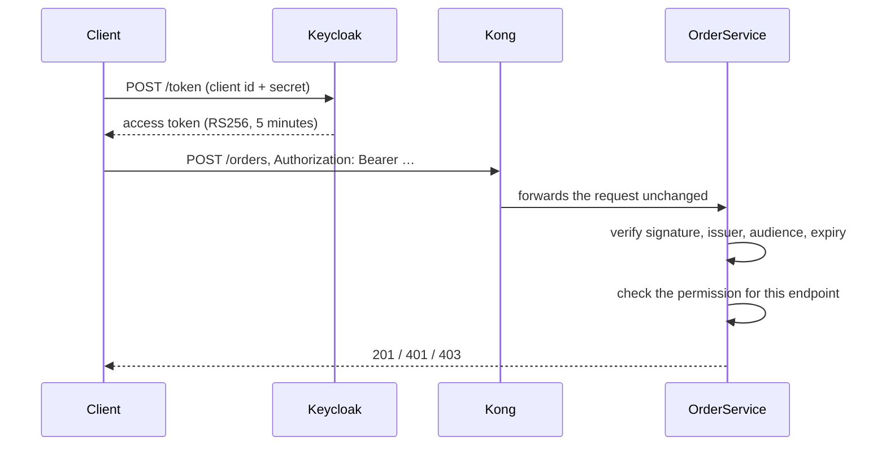

# Identity and tokens

Every call to the Order API must carry a signed access token issued by Keycloak. This document
describes the realm and its clients, how a caller obtains a token, how OrderService validates it, and
how the permissions in the token decide what the caller may do.

---

## Overview



The gateway does not validate tokens; OrderService does. Keeping authorization next to the code that
needs it means the rules are tested together with the API (a dedicated test suite covers every
combination), and a misconfigured gateway cannot let an unauthenticated request through.

## The realm

Keycloak runs in the `transaction-platform` namespace and imports the realm `transaction-platform`
at start-up (`--import-realm`) from a file in its Helm chart, so the realm is defined in the
repository rather than entered by hand. It is locked down to machine-to-machine use:

| Setting | Value | Meaning |
| --- | --- | --- |
| Signature algorithm | RS256 | Tokens are signed with an RSA key; anyone with the public key can verify them |
| Access token lifetime | 300 seconds | A leaked token is useful for five minutes at most |
| User registration | disabled | Nobody can create accounts |
| Login flows | none (no browser login, no password grant) | Only the client-credentials flow is possible |
| TLS | required for external requests | Tokens never travel in plain text outside the cluster |

### Clients and permissions

| Client | Kind | Permissions | Used by |
| --- | --- | --- | --- |
| `order-api` | Audience only — cannot obtain tokens | *(defines the permissions)* | Represents the Order API itself |
| `scenario-runner` | Confidential, service account | `orders.read`, `orders.write`, `traces.debug` | The experiment runner and operators |
| `order-reader` | Confidential, service account | `orders.read` | Reading orders back after an experiment |

The three permissions are roles of the `order-api` client:

| Permission | Allows |
| --- | --- |
| `orders.write` | `POST /orders` |
| `orders.read` | `GET /orders/{orderId}` |
| `traces.debug` | Asking for a request's trace to be kept regardless of sampling (`X-Debug-Trace: true`) |

Two clients with different permissions exist on purpose: the `auth-denied` scenario uses the
read-only client to prove that a perfectly valid token without `orders.write` is refused with 403.

### What a token contains

Two protocol mappers shape the token. An audience mapper adds `order-api` to `aud`; a role mapper
writes the client's roles into a flat `permissions` claim, which keeps the authorization rules simple.
The relevant claims of a real `scenario-runner` token:

```json
{
  "iss": "https://localhost:9443/realms/transaction-platform",
  "aud": "order-api",
  "azp": "scenario-runner",
  "permissions": ["orders.write", "traces.debug", "orders.read"],
  "iat": 1789723192,
  "exp": 1789723492
}
```

## Obtaining a token

Tokens are requested with the OAuth 2.0 client-credentials grant. The client secrets are generated
during deployment and stored in the Kubernetes Secret `keycloak-clients`:

```bash
TLS="--cacert .local/pki/ca.crt --ssl-revoke-best-effort"   # the second flag is needed on Windows only

SECRET=$(kubectl -n transaction-platform get secret keycloak-clients \
  -o jsonpath='{.data.scenario-runner}' | base64 -d)

curl -s $TLS \
  -d grant_type=client_credentials \
  -d client_id=scenario-runner \
  -d "client_secret=$SECRET" \
  https://localhost:9443/realms/transaction-platform/protocol/openid-connect/token
```

The automation does the same in its `TokenProvider`, caches each token and renews it shortly before
it expires.

## One issuer, two addresses

Keycloak is reached under two different addresses, a classic pitfall in container environments:

| Caller | Address | Why |
| --- | --- | --- |
| Clients on the workstation | `https://localhost:9443/realms/transaction-platform` | Through the kind port mapping and TLS |
| OrderService, inside the cluster | `http://keycloak:8080/realms/transaction-platform` | Direct and fast, inside the cluster's trusted network |

A token's issuer (`iss`) must be one fixed value, and it is the public one — the address clients
know. Keycloak is therefore configured with a fixed public hostname, while still answering internal
requests with internal endpoint addresses. OrderService checks `iss` against the public URL but
downloads the signing keys from the internal address. The security suite verifies both views: the
public discovery document over TLS, and the internal one with the public issuer and the internal key
endpoint.

## How OrderService validates a token

A request is accepted only if its token:

1. is signed with **RS256** by a key published by the realm;
2. names the public issuer URL in `iss`;
3. names `order-api` in `aud`;
4. has not expired (30 seconds of clock difference are tolerated);
5. carries the permission required by the endpoint in `permissions`.

| Situation | Answer |
| --- | --- |
| No token, malformed token, wrong signature, expired, wrong issuer or audience | **401** |
| Valid token without the required permission | **403** |
| Valid token with the permission | the request proceeds |

Both answers happen before any business logic runs; the `auth-denied` scenario proves that such
requests reach no dependency at all.

### Key rotation

Keycloak signs tokens with a key it can replace — for example when its pod is replaced and its
temporary database with it. When OrderService sees a token signed with an unknown key id, it fetches
the key set again. The default throttle for such refreshes (five minutes) would reject valid tokens
far too long after a replacement, so it is lowered to **30 seconds**.

### Readiness

OrderService reports itself ready only when it can fetch Keycloak's signing keys. A pod that cannot
validate tokens would answer every request with 401, so it is better kept out of the Service
endpoints until Keycloak is reachable.

## How Keycloak is deployed

| Aspect | Setting |
| --- | --- |
| Mode | Keycloak's production start mode, importing the realm file on start |
| Database | A file-based development database on a temporary pod volume (`emptyDir`): it survives container restarts, but is re-created, and the realm imported again, whenever the pod is replaced |
| Public endpoint | HTTPS on port 8443 with the `keycloak-tls` certificate, exposed as NodePort 31443 → `127.0.0.1:9443` |
| Internal endpoint | HTTP on port 8080, reachable only from OrderService |
| Health | Keycloak's management port, over HTTPS |
| Admin account | Generated at first deployment, stored in the Secret `keycloak-admin` |

## Limits

- **No service-to-service authentication.** The four dependencies accept calls without tokens;
  the network policy that lets only OrderService reach them is the boundary
  ([network-policies.md](network-policies.md)).
- **No persistence for Keycloak.** Signing keys change when the Keycloak pod is replaced; the
  30-second key refresh covers this, but tokens issued before the replacement become invalid.
- **Client secrets never rotate** unless the Secret is deleted and the identity component redeployed.

Production alternatives are listed in [production-considerations.md](production-considerations.md).

## Related documents

- [Security](security.md) — the trust boundaries around identity
- [API reference](api-reference.md) — which endpoint needs which permission
- [Gateway](gateway.md) — why the gateway does not validate tokens itself
- [Scenario catalog](scenario-catalog.md) — the `auth-denied` experiment
