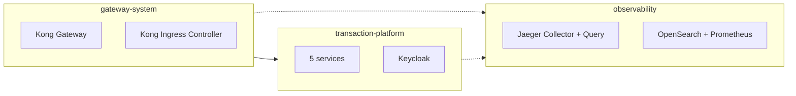

# Kubernetes platform

Everything runs on one local Kubernetes cluster created with [kind](https://kind.sigs.k8s.io/).
This document describes the cluster, the namespaces, the settings every workload follows, how the
components are packaged, and where data is stored.

---

## The cluster

| Property | Value | Reason |
| --- | --- | --- |
| Name / context | `txplatform` / `kind-txplatform` | The automation refuses to run against any other context |
| Nodes | 1 control plane, 2 workers | Pods can be spread across nodes, so node attribution in traces is meaningful |
| Kubernetes version | 1.36.4, node image pinned by digest | The Kong Ingress Controller supports up to 1.36; the digest guarantees an identical cluster every time |
| Network plugin | kindnet | Enforces NetworkPolicy, which the platform depends on |
| Storage | kind's `local-path` provisioner | Persistent volumes for OpenSearch and Prometheus |
| Host ports | `127.0.0.1:8443 → 30443` (Kong), `127.0.0.1:9443 → 31443` (Keycloak) | Only two entry points, and only on loopback |

The cluster definition is [`deploy/kind/cluster.yaml`](../deploy/kind/cluster.yaml).

**Images.** The five service images are built locally and loaded directly into the nodes with
`kind load`; no registry is involved. Each image is tagged with a hash of its source code. An
unchanged service therefore keeps its tag, and Kubernetes does not restart its pods on redeployment —
the `recovery` suite verifies that redeploying every component leaves every pod untouched.

## Namespaces

| Namespace | Contents | Pod Security | Network baseline |
| --- | --- | --- | --- |
| `gateway-system` | Kong Gateway, Kong Ingress Controller | restricted | Ingress denied; egress restricted per workload |
| `transaction-platform` | The five services, Keycloak | restricted | Ingress and egress denied |
| `observability` | Jaeger Collector and Query, OpenSearch, Prometheus, index cleaner | restricted | Ingress and egress denied |

Three settings apply to every namespace:

- **Pod Security: restricted.** Kubernetes admits only pods that run as a non-root user, cannot gain
  privileges, drop all Linux capabilities and use the default seccomp profile. The level is enforced,
  not just reported ([security.md](security.md)).
- **Deny-all network baseline.** No traffic flows until a component chart allows a specific
  connection; DNS is the only exception ([network-policies.md](network-policies.md)).
- **A LimitRange safety net.** Default requests (50m CPU, 64 MiB) and limits (500m, 256 MiB) for
  containers that declare none. Every workload declares its own; a validation check fails if any
  workload template relies on the defaults.

`gateway-system` does not deny egress namespace-wide because the ingress controller must reach the
Kubernetes API, whose address differs per cluster; Kong's proxy pod still has its own egress rules.
`transaction-platform` carries the label `txplatform.io/gateway-access=true`, which is what allows its
routes to attach to the shared Gateway ([gateway.md](gateway.md)).

## Workload settings

All five services share one Deployment template. Each setting exists for a reason that shows up in
the experiments:

| Setting | Value | Why |
| --- | --- | --- |
| Rolling update | `maxUnavailable: 0`, `maxSurge: 1` | A replacement pod is ready before an old one stops |
| Pre-stop delay | 5 s, grace period 30 s | A stopping pod keeps serving while Kubernetes removes it from the endpoints |
| Startup probe | `/health/live`, every 2 s, up to 30 failures | A slow first start never causes a restart loop |
| Readiness probe | `/health/ready`, every 5 s, 2 failures | An unhealthy pod stops receiving new traffic quickly |
| Liveness probe | `/health/live`, every 10 s, 3 failures | Only a truly stuck process is restarted |
| Probe port | 8081 (management) | Probes never mix with business traffic and create no spans |
| User | uid/gid 1654, non-root | Required by the restricted level |
| Filesystem | read-only root, writable `/tmp` only | A compromised process cannot modify the image |
| Capabilities | all dropped, no privilege escalation | Required by the restricted level |
| Service account token | not mounted | The services never call the Kubernetes API |
| Kubernetes metadata | pod, node, namespace and deployment via the Downward API | Spans name the pod that produced them without any cluster access |

**Replicas.** FraudService runs two replicas spread across the two workers
(`topologySpreadConstraints` counting only pods of the same revision, so a rolling update can still
place its extra pod). The other services run one replica: PaymentService must, because its
idempotency records live in memory, and the others do so deliberately so that the cost of having no
redundancy is visible in the experiments rather than hidden ([resilience.md](resilience.md)).

**Seed data.** The product catalog and stock levels are mounted from ConfigMaps as a JSON file. The
pod template carries a checksum of the seed data, so changing it restarts exactly the affected
service.

## Packaging

The platform uses eight Helm releases: five charts written for this project and three maintained
upstream charts configured through local values files.

| Release | Chart | Namespace | Creates |
| --- | --- | --- | --- |
| `platform-foundation` | project | `default` | Namespaces, Pod Security labels, LimitRanges, deny-all and DNS policies |
| `gateway` | project | `gateway-system` | GatewayClass, Gateway, global tracing plugin, Kong's network policies |
| `kong` | upstream `kong/ingress` 0.24.0 | `gateway-system` | Kong Gateway and the Kong Ingress Controller |
| `identity` | project | `transaction-platform` | Keycloak, its realm import, its network policy |
| `opensearch` | upstream `opensearch/opensearch` 3.8.0 | `observability` | OpenSearch (single node) |
| `observability` | project | `observability` | Jaeger Collector and Query, their configuration, the retention CronJob, network policies |
| `prometheus` | upstream `prometheus-community/prometheus` 29.30.0 | `observability` | Prometheus server only |
| `transaction-services` | project | `transaction-platform` | The five services, their Services, seed data, network policies, the HTTPRoute and edge plugins |

Charts are split by ownership: the platform team owns the foundation, gateway and observability; the
application owns its services, including the route and edge policies that expose them. Upstream
components are used as published rather than re-implemented.

Deployment order matters and is fixed in the automation:
`foundation → certificates → crds → gateway → kong → identity → observability → services`. For
example, the `gateway` chart must exist before Kong starts, because it contains the network policy
that lets the ingress controller reach Kong's admin API.

## Storage

| Volume | Size | Owner | Survives |
| --- | --- | --- | --- |
| OpenSearch data | 5 GiB | `opensearch-traces-0` | Pod restarts (verified: a stored trace survives an OpenSearch restart) |
| Prometheus data | 2 GiB | `prometheus-server` | Pod restarts |

Both use kind's default storage class `standard`, served by the local-path provisioner, which stores
data inside the kind node containers; deleting the cluster deletes the data. Keycloak keeps a file
database on a temporary pod volume and imports its realm whenever the pod is replaced, which is
acceptable because the realm is defined in the chart, not entered by hand.

## Resource footprint

| Component | Memory limit |
| --- | --- |
| OpenSearch | 1.5 GiB (768 MiB heap) |
| Jaeger Collector | 768 MiB |
| Prometheus | 768 MiB |
| Kong Gateway | 512 MiB |
| OrderService | 256 MiB |
| Other services, Kong controller, Jaeger Query | 192–256 MiB each |

Together with Keycloak and the Kubernetes system components, the platform fits into the 8 GB
minimum given to Docker; 10 GB leaves comfortable headroom.

## Related documents

- [Network policies](network-policies.md) — the allowed connections in detail
- [Security](security.md) — Pod Security, secrets and trust boundaries
- [Configuration reference](configuration-reference.md) — where each setting is defined
- [Operations](operations.md) — redeploying, inspecting and cleaning up
