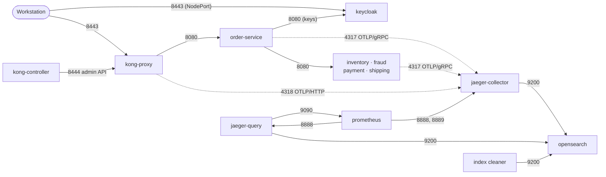

# Network policies

Inside the cluster, no workload may talk to another unless a rule explicitly allows it. This document
explains how the rules are written, lists every allowed connection, shows how the rules are tested
against real traffic, and describes one behavior of default-deny networking that surprises many
people.

A Kubernetes **NetworkPolicy** is a firewall rule expressed in terms of pod labels rather than IP
addresses. The cluster's network plugin, kindnet, enforces them.

---

## Writing rules by network identity

Policies do not select pods by their application name. Every pod that takes part in a rule carries a
dedicated label:

```yaml
txplatform.io/network-identity: order-service
```

The label is the pod's **network identity**: a statement of what the pod is allowed to do on the
network. It stays stable when a chart renames a deployment or adds other labels, and it is applied
the same way to the project's own charts and to third-party ones (Kong, OpenSearch and Prometheus get
it through their values files). As a result, every rule in the platform reads the same way: "pods
with identity X may reach pods with identity Y on port Z".

## The baseline

The foundation chart creates each namespace with two policies:

1. **Deny all** — no incoming and no outgoing traffic for any pod.
2. **Allow DNS** — every pod may resolve names through the cluster DNS.

Nothing else works until a component chart adds a rule for it.

`gateway-system` is the one exception to "deny outgoing": its ingress controller must reach the
Kubernetes API server, whose address changes with every cluster, so outgoing traffic is restricted
per workload instead of namespace-wide. Kong's proxy pod has explicit outgoing rules.

## Every allowed connection



| From (identity) | To (identity) | Port | Purpose |
| --- | --- | --- | --- |
| anywhere (via NodePort) | `kong-proxy` | 8443 | The Order API |
| anywhere (via NodePort) | `keycloak` | 8443 | Token requests |
| `kong-controller` | `kong-proxy` | 8444 | Pushing configuration to Kong's admin API |
| `kong-proxy` | `order-service` | 8080 | Forwarding orders |
| `order-service` | `inventory-service`, `fraud-service`, `payment-service`, `shipping-service` | 8080 | The transaction's calls |
| `order-service` | `keycloak` | 8080 | Fetching token-signing keys |
| `order-service` and the four dependencies | `jaeger-collector` | 4317 | Exporting spans (OTLP/gRPC) |
| `kong-proxy` | `jaeger-collector` | 4318 | Exporting spans (OTLP/HTTP) |
| `jaeger-collector`, `jaeger-query`, `jaeger-index-cleaner` | `opensearch` | 9200 | Writing, reading and expiring traces |
| `jaeger-query` | `prometheus` | 9090 | Reading span metrics for the Monitor tab |
| `prometheus` | `jaeger-collector` | 8888, 8889 | Scraping self-metrics and span metrics |
| `prometheus` | `jaeger-query` | 8888 | Scraping self-metrics |

## What is deliberately impossible

Everything not in the table is denied. Some of these denials are design decisions worth stating:

| Denied connection | Why |
| --- | --- |
| A dependency calling another dependency or OrderService | Dependencies are leaves of the call graph; a compromised one cannot move sideways |
| Any pod reaching a **management port** (8081), including OrderService | Operator functions — faults, breaker reset, ledger — must not be reachable over the network |
| Any pod except OrderService reaching Keycloak's internal port | Only OrderService needs the signing keys |
| Pods in other namespaces reaching any private service | Namespaces are trust zones |
| OpenSearch opening any connection | The single-node store has nothing to talk to |
| Anything except the producers reaching the Collector's OTLP ports | Nobody else can inject spans into the trace pipeline |

## Tested against real traffic

Policies that exist but do not work — typically because a label drifted — are a common and silent
failure. The platform therefore never trusts the YAML; it tests the behavior.

**Probe pods.** A validation check starts a short-lived pod with a chosen network identity in a
chosen namespace, lets it try to open TCP connections to a list of targets, and compares each result
with the expected one. The probe pods themselves comply with the restricted Pod Security level and
are deleted afterwards.

| Suite | Connections probed | Examples |
| --- | --- | --- |
| `security` | 13 | OrderService reaches all four dependencies and Keycloak's internal port · OrderService cannot reach a management port · InventoryService cannot reach PaymentService, OrderService or Keycloak's internal port · a pod in `default` reaches none of the private services but does reach Keycloak's public port |
| `observability` | 7 | The Collector reaches OpenSearch; Prometheus and OrderService do not · OrderService cannot reach Jaeger Query or Prometheus · OrderService reaches the Collector's OTLP port; an anonymous pod from `default` does not |
| `edge` | Kong's rules | Kong's proxy reaches OrderService and nothing else in the application namespace; only the controller reaches Kong's admin API |

**Enforcement itself.** A separate foundation check proves that the cluster enforces network policies
at all: it starts a server and a client in a throwaway namespace, confirms they can talk, applies a
deny policy, and confirms they no longer can. If the network plugin ignored policies, every other
check above could pass for the wrong reason.

## Port-forwarding is not affected

`kubectl port-forward` opens a tunnel through the Kubernetes API and the node's kubelet directly into
the pod; it does not travel over the pod network, so network policies do not apply to it. That is
why operators and the scenario runner can reach management ports, Jaeger Query and Prometheus even
though no pod can. Access to port-forwarding is controlled by Kubernetes credentials instead.

## A behavior to know: no endpoints means a timeout, not a refusal

When a Service has no ready pods, the node's service proxy normally rejects new connections to it,
so a caller fails within milliseconds with "connection refused". Under a default-deny outgoing
policy, the connection attempt is **dropped before** that rejection can happen, so the caller hears
nothing and waits for its own timeout.

The `dependency-unavailable` scenario shows the consequence. With ShippingService scaled to zero,
each order waits for three one-second attempts and fails with **504** (`timeout`) instead of failing
quickly with **503** (`unavailable`):

| Without the network policy | With the network policy (this platform) |
| --- | --- |
| Connection refused immediately | Attempt times out after 1 second |
| Failure kind `unavailable`, HTTP 503 | Failure kind `timeout`, HTTP 504 |
| Order fails in milliseconds | Order fails after about 3.5 seconds |

This is not a defect, but it changes how quickly a missing dependency is detected, and it is why the
scenario expects a timeout. Attempt timeouts and the circuit breaker bound the cost
([resilience.md](resilience.md)).

## Where the rules live

| Rules | File |
| --- | --- |
| Deny-all and DNS baseline | `deploy/charts/platform-foundation/templates/network-policies.yaml` |
| Kong proxy and controller | `deploy/charts/gateway/templates/network-policies.yaml` |
| Keycloak | `deploy/charts/identity/templates/network-policy.yaml` |
| OrderService and the dependencies | `deploy/charts/transaction-services/templates/network-policies.yaml` |
| Collector, Query, OpenSearch, Prometheus, index cleaner | `deploy/charts/observability/templates/network-policies.yaml` |

## Related documents

- [Security](security.md) — how network isolation fits into the other controls
- [Kubernetes platform](kubernetes-platform.md) — namespaces and their baselines
- [Validation suites](validation-suites.md) — the checks that probe these rules
- [Resilience](resilience.md) — how timeouts and breakers contain a missing dependency
