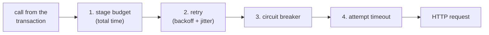
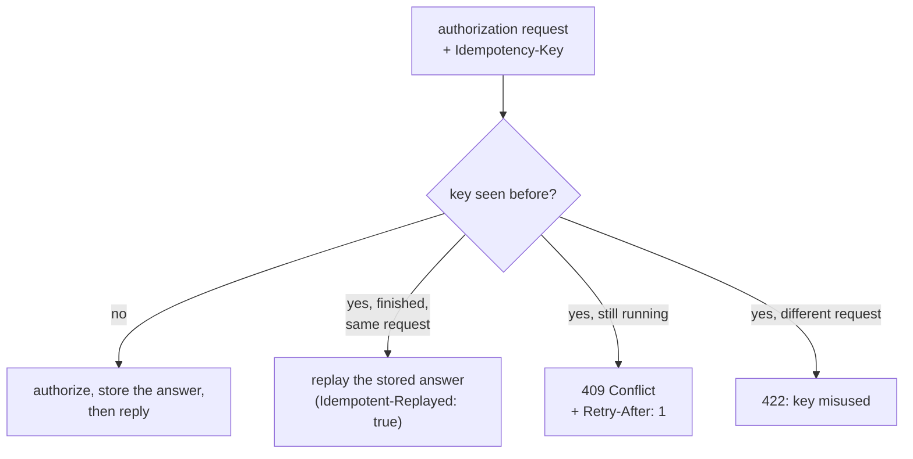

# Resilience

A distributed transaction is only as reliable as its weakest call. This document explains how
OrderService protects every call to a dependency, how payments are made safe to retry, how the
platform survives pods being restarted or removed, and what was measured when those situations were
provoked on purpose.

---

## What can go wrong with a call

When OrderService calls another service, one of five things happens:

| Outcome | Example | What a naive client does |
| --- | --- | --- |
| Success | 201 Created | – |
| Business rejection | 422 "insufficient stock" | Nothing wrong — but must not retry |
| Server error | 500, 503 | Fails, or retries forever |
| No answer | The dependency hangs | Waits until the client gives up — possibly forever |
| No connection | The pod is gone | Fails immediately, or hangs, depending on the network |

The resilience design gives every outcome a defined, bounded behavior.

## The protection chain

Every call passes through four layers, from the outside in:

| Layer | Purpose | Why it sits here |
| --- | --- | --- |
| 1. Stage budget | Caps the total time one step may take, retries included | Outermost, so no combination of retries can exceed it |
| 2. Retry | Repeats attempts that failed for a transient reason | Above the breaker, so the breaker judges every single attempt |
| 3. Circuit breaker | Stops calling a dependency that keeps failing | Below the retry, so an open circuit ends the retries immediately |
| 4. Attempt timeout | Caps how long one attempt may wait | Innermost, so one slow answer cannot consume the whole budget |

The chain is built with Microsoft's resilience library (Polly v8) and configured per dependency.

## Settings per dependency

| Dependency | Attempt timeout | Attempts | Stage budget | Circuit breaker |
| --- | --- | --- | --- | --- |
| Inventory | 1.0 s | 2 | 2.5 s | yes |
| Fraud | 0.7 s | 2 | 1.8 s | yes |
| Payment | 1.5 s | 3 | 5.5 s | yes |
| Shipping | 1.0 s | 3 | 4.0 s | yes |
| Undo: release stock | 0.5 s | 2 | 1.2 s | no |
| Undo: void payment | 0.5 s | 2 | 1.2 s | no |

The values differ on purpose:

- **Fraud** is fast and cheap, so a slow answer is a strong sign of trouble — it gets the tightest
  timeout.
- **Payment** gets the most patience and the most attempts: giving up on a payment is expensive, and
  retrying it is safe only because of the idempotency key.
- **Undo calls** run after a failure has already happened; they must be short so they do not stretch
  the customer's wait, and they skip the breaker so an undo is always attempted.

These values are part of the services' designed behavior and are covered by tests, so they live in
code (`DependencyPolicies.cs`) rather than in deployment configuration.

## What is retried — and what is not

| Outcome | Retried? | Reason |
| --- | --- | --- |
| Attempt timeout | Yes | The next attempt may reach a healthy replica |
| Connection failure | Yes | The pod may have just been replaced |
| 502, 503, 504 | Yes | Typical transient server-side failures |
| 409 from Payment ("still in progress") | Yes, for payment only | The first attempt is still running; waiting for its answer is the right move |
| 500 and other 5xx | No | Not a transient signal; retrying would only repeat the error |
| 4xx business answers | No | The answer will not change |
| Open circuit | No | Failing fast is the purpose of the breaker |
| Budget exhausted | No | There is no time left |

**Backoff.** The pause before a retry starts at about 200 ms and roughly doubles each time, with a
random variation ("jitter") so that many requests failing together do not retry in lock-step and
create a new burst.

**Visibility.** Each attempt carries an `X-Attempt` header, so the dependency knows which attempt it
received. In the trace, every attempt is its own client span with `retry.attempt`, and the step
records one `retry` event per retry with the failed attempt, the pause and the reason
([tracing.md](tracing.md)).

### Worked example: a payment that never answers

In the `payment-timeout` scenario PaymentService holds every request. One order then goes through:

| Time (approx.) | What happens |
| --- | --- |
| 0.0 s | Inventory and fraud succeed (a few milliseconds) |
| 0.0 s | Payment attempt 1 starts |
| 1.5 s | Attempt 1 times out → `retry` event, pause ~0.2 s |
| 1.7 s | Attempt 2 starts |
| 3.2 s | Attempt 2 times out → `retry` event, pause ~0.4 s |
| 3.6 s | Attempt 3 starts |
| 5.1 s | Attempt 3 times out → the step fails with `timeout` |
| 5.1 s | Compensation: void payment (nothing to void), release stock |
| ≈5.2 s | The order answers **504** with state `PaymentFailed` |

Three orders produce nine failed attempts — just below the circuit breaker's threshold of ten, which
is why the scenario sends exactly three.

## Circuit breaker

Each dependency has its own breaker:

| Setting | Value |
| --- | --- |
| Opens when | at least **10** calls within **30 seconds**, and at least **50 %** of them failed |
| Counts as a failure | attempt timeouts, connection failures, 5xx answers |
| Never counts | business rejections (4xx) |
| Stays open for | 5 seconds, then lets a trial call through |
| While open | calls fail immediately as `unavailable` (503), without touching the network |

Breaker state changes are recorded as `circuit.state_changed` events. Operators can close every
breaker at once through OrderService's management port (`POST /internal/resilience/reset`); the
scenario runner does this before each experiment, so an outage in one experiment can never leak into
the next. An integration test proves the whole cycle: ten failures open the circuit, a healthy
dependency is then *not* called, and the reset makes it usable again immediately.

## Idempotent payments

A retry must never charge a customer twice, even when the first attempt succeeded and only its reply
was lost. PaymentService keeps a record for every `Idempotency-Key`:

Four details make this safe:

1. **Claiming a key is atomic.** Two identical requests arriving at the same moment cannot both be
   processed; the second one receives 409 and retries.
2. **The answer is stored before it is sent.** If the reply is lost on the way, the stored answer is
   what the retry receives — this is exactly what the `payment-retry` scenario provokes.
3. **A fingerprint** of the request (order, amount, currency, token) is stored with the key, so the
   same key cannot be reused for a different payment.
4. **One replica.** The records live in memory, so PaymentService runs exactly one replica; two
   replicas would each keep their own records and break the guarantee.

Measured in `payment-retry`: four orders, two attempts each, and the payment ledger shows **exactly
one** authorization per order; the trace shows the second attempt answered as a replay.

## Surviving Kubernetes changes

Application-level protection is not enough when pods come and go. The Kubernetes settings work
together with it:

| Mechanism | Setting | Effect |
| --- | --- | --- |
| Rolling updates | `maxUnavailable: 0`, `maxSurge: 1` | A new pod is ready before an old one stops |
| Pre-stop delay | 5 seconds (grace period 30 s) | A stopping pod keeps serving while it is removed from the Service endpoints |
| Readiness probe | every 5 s, unready after 2 failures | An unhealthy pod stops receiving *new* connections without being killed |
| Pooled connection lifetime | 30 seconds | Existing connections are recycled, so clients move off a pod that is no longer ready |
| Retries on connection failure | see above | A request that hits a closing connection is retried on a new one |

What the platform survives, measured by the scenarios:

| Scenario | What was done | Result |
| --- | --- | --- |
| `rolling-restart` | FraudService (2 replicas) restarted during 60 s of traffic | 240 of 240 orders completed, zero error spans |
| `pod-deletion` | The only PaymentService pod deleted during 40 s of traffic | 80 of 80 orders completed |
| `readiness-loss` | One FraudService pod made unready while serving | 360 of 360 orders completed; traffic moved away from the pod |
| `dependency-unavailable` | ShippingService scaled to zero | Every order failed with 504 after three attempts, and was compensated |

The last row shows the limit of any resilience design: when a dependency has no instance at all, the
platform can only fail cleanly. It also reveals a network detail — the failure appears as a *timeout*
rather than a refused connection, because the default-deny network policy drops packets to a Service
without endpoints ([network-policies.md](network-policies.md)).

## Limits

- Retries and compensation run inside OrderService. If OrderService itself dies mid-transaction,
  nothing resumes the order.
- An undo call gets two attempts within 1.2 seconds; if both fail, the failure is recorded and
  nothing retries it later.
- Circuit breaker state is per OrderService pod.
- Single-replica services (all except FraudService) cannot hide their own failure; they rely on the
  pre-stop delay and retries during planned restarts.

Production alternatives are described in [production-considerations.md](production-considerations.md).

## Related documents

- [Transaction flow](transaction-flow.md) — states, failure kinds and compensation
- [Services](services.md) — PaymentService and the other dependencies
- [Scenario catalog](scenario-catalog.md) — the experiments quoted above
- [Kubernetes platform](kubernetes-platform.md) — probes and rollout settings
