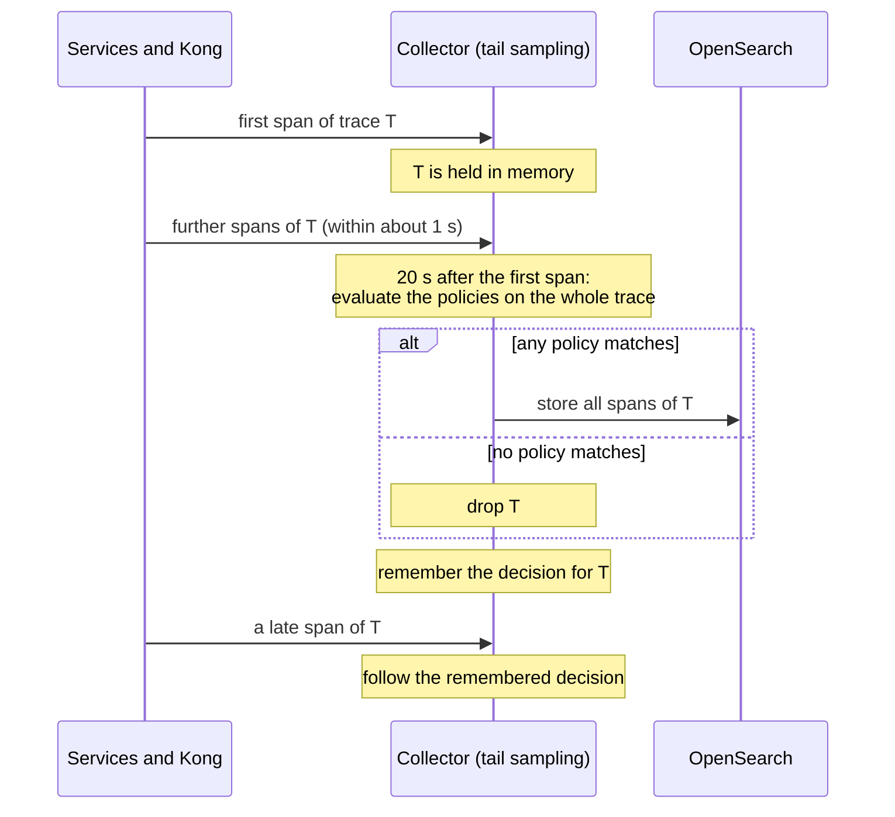

# Sampling

Storing every trace of a busy system is expensive, and most traces look alike. The platform
therefore stores all traces that are interesting and a fixed share of the rest — and it decides
**after** seeing the whole trace. This document explains the policies, the timing behind them, and
how their correctness is checked.

---

## Head sampling or tail sampling

**Sampling** means deciding which traces to keep. There are two places to decide:

| Approach | When the decision is made | Consequence |
| --- | --- | --- |
| Head sampling (in the service) | When the request starts, before anything has happened | Errors and slow requests are dropped as often as boring ones — exactly the traces an operator needs most |
| **Tail sampling (in the Collector)** — used here | After all spans of the trace have arrived | Every error and every slow request can be kept; costs memory in the Collector and requires all spans of a trace to reach the same Collector |

The services record and export every span, and only the Collector decides. As a result, no service
needs sampling settings, and two services can never make contradicting decisions about the same
trace.

## The policies

A trace is stored when **any** policy matches:

| Policy | Matches when | Purpose |
| --- | --- | --- |
| `errors` | any span has the status ERROR | Never lose a technical failure |
| `slow` | the trace lasts at least **1 000 ms** from its first span's start to its last span's end | Never lose a latency problem |
| `debug` | any span carries `sampling.debug = true` | A caller with the `traces.debug` permission asked for this trace |
| `baseline` | the trace id falls into a **25%** share | Keep a representative sample of normal traffic |

The `baseline` policy hashes the trace id, so the decision is random across traces but repeatable
for any one trace id.

Business rejections — insufficient stock, a declined card, a fraud refusal — are not errors
([tracing.md](tracing.md)), so their traces are sampled like any other ordinary trace. The experiment
runner sends its requests with the debug flag, which makes its verification independent of this
chance ([telemetry-contracts.md](telemetry-contracts.md)).

## How the decision is timed



| Setting | Value | Reason |
| --- | --- | --- |
| Decision wait | **20 s** | Longer than the slowest possible transaction (12-second budget) plus the one-second export delay of the services |
| Traces held in memory | 20 000 | Bounds the memory used by traces waiting for a decision |
| Expected new traces per second | 100 | A sizing hint for the Collector's internal structures |
| Decision cache | 50 000 kept ids and 50 000 dropped ids | Late spans follow the decision already made for their trace |

### Late spans

A span can arrive after its trace was decided — for example when a dependency is still working on a
request its caller has already abandoned. Without a memory of past decisions, such a span would
start a new, nearly empty trace. With the decision cache, the Collector applies the earlier
decision: the span joins the stored trace, or is dropped like the rest of it.

## What sampling does not affect

Dropping a trace never hides the fact that the request happened. The span metrics are computed
before the sampling stage ([telemetry-pipeline.md](telemetry-pipeline.md)), so request rates, error
rates and latency histograms cover all traffic. In the `kong-rate-limit` scenario, all 76 requests
rejected with 429 were counted in the metrics, whether or not their traces were stored.

## Overload behavior

If more new traces arrive within one decision window than the Collector can hold, the oldest
undecided traces are dropped **before** their decision and counted in
`otelcol_processor_tail_sampling_sampling_trace_dropped_too_early`.

The `recovery` suite forces this on purpose: it sends 25 000 traces within one window to a buffer
of 20 000. Measured: 5 000 traces were dropped before their decision, the Collector kept running
without a restart, and a trace sent afterwards was stored normally.

A steady rise of this metric in normal operation is a warning sign: the buffer or the decision
window no longer fits the traffic.

## How the policies are verified

The `telemetry-pipeline` suite sends synthetic traces with exactly chosen properties and inspects
the result after the decision window:

| Sent | Expected |
| --- | --- |
| 5 error traces, 5 slow traces (1 500 ms), 5 debug-flagged traces | All 15 stored |
| 400 ordinary traces | A number inside the tolerance band for 25% (see below) |
| A child span sent one full decision window after its kept parent | Stored next to its parent |

### Why the baseline check uses a tolerance band

A 25% random sample of 400 traces does not store exactly 100. Checking for an exact number would fail
regularly although nothing is wrong. The suite therefore accepts any count within **4.5 standard
deviations** of the expected value — for 400 traces, **61 to 139**. A correctly configured Collector
fails this check about once in 150 000 runs, while a broken policy (for example 0% or 100%) fails it
every time.

Measured counts from real runs: 92, 98, 117 and 120 of 400.

## Changing the numbers

The policy values are in `deploy/charts/observability/values.yaml`:

```yaml
collector:
  sampling:
    decisionWait: 20s
    maxTracesInMemory: 20000
    expectedNewTracesPerSecond: 100
    decisionCacheSize: 50000
    slowThresholdMs: 1000
    baselinePercentage: 25
```

After a change, redeploy the component; the Collector restarts with the new configuration:

```bash
uv run platformctl deploy --component observability
```

Two automated checks depend on these numbers:

- The telemetry-pipeline suite asserts the documented 25% rate, so a change to `baselinePercentage`
  must be matched by `BASELINE_PROBABILITY` in
  `automation/src/txplatform/validation/telemetry_pipeline.py`.
- The checks wait 35 seconds (`DECISION_DELAY_SECONDS`) before reading traces from Jaeger, so the
  decision wait must stay well below that.

## Related documents

- [Telemetry pipeline](telemetry-pipeline.md) — where sampling sits in the Collector
- [Metrics and monitoring](metrics-and-monitoring.md) — the metrics that sampling does not reduce
- [Trace storage](trace-storage.md) — where kept traces go
- [Tracing](tracing.md) — the debug flag and error marking
