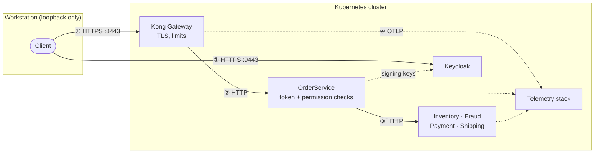

# Security

The platform is a local environment, but its security boundaries are real: each one is enforced by
configuration and proven by an automated check against the running cluster. This document describes
those boundaries, the controls behind them, and — separately — where local convenience was chosen
over production strength.

---

## Trust boundaries

| Boundary | Protected by | Verified by |
| --- | --- | --- |
| ① Outside → cluster | Only two ports exist, bound to `127.0.0.1`; both use TLS with the local CA | `foundation` (host bindings) and `security` (exposed Services) suites |
| ② Gateway → application | Rate and size limits at Kong; token, permission and input validation in OrderService | `edge` and `security` suites, `auth-denied` and edge scenarios |
| ③ Application → dependencies | Network policies: only OrderService may call them | `security` suite probes 13 connections from inside the cluster |
| ④ Everything → telemetry | Network policies on the OTLP ports; redaction in the Collector | `observability` suite, `telemetry-pipeline` suite, every scenario's sensitive-data check |

## Exposure

Only two things can be reached from outside the cluster, and only from the workstation itself:

| Address | Service | Protocol |
| --- | --- | --- |
| `127.0.0.1:8443` | Kong Gateway (Order API) | HTTPS |
| `127.0.0.1:9443` | Keycloak (tokens) | HTTPS |

Everything else — Jaeger, Prometheus, OpenSearch, Kong's admin API, every service's management port
— is cluster-internal and reached through `kubectl port-forward`, which requires Kubernetes
credentials. A security check lists every `NodePort` and `LoadBalancer` Service in the cluster and
fails if the list is anything other than these two. It guards against defaults of third-party charts:
Kong's chart, for example, exposes its Manager UI as a NodePort unless it is switched off, which the
platform's values do.

## Two ports per service

| Port | Serves | Reachable through |
| --- | --- | --- |
| 8080 | Business API | The Kubernetes Service; for OrderService also the gateway |
| 8081 | Health checks, fault rules, circuit-breaker reset, payment ledger | Only the pod itself (probes) and `kubectl port-forward` |

The separation is enforced inside each service: a request for `/internal/...` on the business port
is refused, and so is a business request on the management port. No Service, route or gateway points
at port 8081, and the network policies do not allow any pod to reach it — not even OrderService. This
is what allows operator functionality such as fault injection to exist in a deployed system without
becoming an attack surface.

## Authentication and authorization

Every Order API request needs a Keycloak token that is correctly signed, issued by the platform's
realm, meant for the Order API, unexpired, and that carries the permission required by the endpoint.
Tokens live five minutes. Only the client-credentials flow exists; there are no user accounts and no
password logins. Details: [identity-and-tokens.md](identity-and-tokens.md).

Retaining a trace regardless of sampling (`X-Debug-Trace: true`) is itself a permission
(`traces.debug`). Without that rule any caller could force the platform to store all of its traces —
a cost problem and a way to overload trace storage.

## Pod security

All three namespaces enforce the Kubernetes **restricted** Pod Security Standard. Kubernetes refuses
any pod that does not:

- run as a non-root user,
- forbid privilege escalation,
- drop all Linux capabilities,
- use the default seccomp profile (a filter on which kernel calls a process may make),
- avoid host networking, host ports, host paths and privileged mode.

The .NET services go further: a read-only root filesystem (only `/tmp` is writable) and no mounted
Kubernetes service-account token, because they never call the Kubernetes API. Third-party components
(Kong, OpenSearch, Prometheus, Keycloak) are configured to comply rather than exempted — for example,
the OpenSearch chart's file-permission helper, which would run as root, is disabled because the local
volumes do not need it.

The `foundation` suite proves enforcement by asking each namespace to admit a privileged pod (as a
server-side dry run) and expecting a rejection.

## Network isolation

Every namespace starts with a policy that denies all traffic, then allows specific connections by
**network identity** (a label that says what a pod is allowed to do). Dependencies cannot call each
other, nothing can reach a management port, OpenSearch talks to nobody, and pods from other
namespaces reach nothing private. See [network-policies.md](network-policies.md).

## Secrets

| Secret | Contents | Created by |
| --- | --- | --- |
| `keycloak-admin` | Keycloak's administrator account | Generated at first deployment |
| `keycloak-clients` | Client secrets of `scenario-runner` and `order-reader` | Generated at first deployment |
| `edge-tls` (gateway-system) | Server certificate and key for Kong | From the local CA in `.local/pki` |
| `keycloak-tls` (transaction-platform) | Server certificate and key for Keycloak | From the local CA in `.local/pki` |

- Generated secrets are random, created only if missing, and never written into values files or
  ConfigMaps. The realm file references client secrets as placeholders that Keycloak fills from
  environment variables at start-up.
- A security check searches every ConfigMap and every Helm release's computed values for the actual
  secret values and fails if one appears.
- The local certificate authority and its key stay in `.local/pki`, which git ignores. The server
  certificate is valid for 90 days; `platformctl status` shows how many days remain.

## Data that must never be stored

Sensitive data is kept out of telemetry by two independent layers:

1. **At the API.** The Order API accepts only opaque payment tokens and refuses any token containing
   12 to 19 consecutive digits, so a card number cannot enter the platform, its logs or its traces.
   Request and response bodies and headers are never recorded on spans, and the caller's IP address
   is removed from service spans.
2. **In the Collector.** Attributes whose names suggest credentials or card data are deleted, full
   URLs are reduced to their path (a query string can carry a token), and the client IP address on
   Kong's span is replaced with its SHA-256 hash ([telemetry-pipeline.md](telemetry-pipeline.md)).

Both layers are tested continuously. Every scenario request carries a **canary** — a fake API key
header that no component should ever record. Every trace a scenario verifies is searched, span by
span, for that canary (in attributes, events and resource attributes) and for credential-like
attribute names. In addition, the telemetry-pipeline suite sends spans that deliberately contain an
authorization header, a password, a card number and a token in a URL, then verifies that none of them
is stored.

## Trace identity cannot be forged

Kong ignores any `traceparent` a client sends and removes incoming `tracestate` and `baggage`
headers; OrderService discards all incoming baggage and accepts only validated ids. A client
therefore cannot join someone else's trace, inject attributes into every span, or influence which of
its traces are stored ([gateway.md](gateway.md), [tracing.md](tracing.md)).

## The automation cannot touch another cluster

Every Kubernetes call made by `platformctl` and `scenarioctl` passes through a guard that refuses to
run unless the target context is the local `kind-txplatform` cluster and its API server is on the
local machine. A misconfigured kubeconfig therefore cannot turn an experiment into an incident on a
real cluster.

## Local simplifications

These are deliberate choices for a single-workstation environment. Each is safe *here* and each
would change in production ([production-considerations.md](production-considerations.md)):

| Area | Local choice | Production counterpart |
| --- | --- | --- |
| Traffic inside the cluster | Plain HTTP | Mutual TLS between workloads |
| Service-to-service authorization | Network policies only | Also authenticate each call (mTLS identities or tokens) |
| Certificate authority | Generated locally, 90-day certificate | Managed CA with automated issuance and rotation |
| Keycloak | Single instance, file database | Replicated, external database, backups, real hostname |
| OpenSearch | No authentication, no TLS | Authentication, TLS, role-based access |
| Secrets at rest | Kubernetes Secrets (encoded, not encrypted by the platform) | Encryption at rest with a KMS, or an external secret manager |
| Fault injection | Enabled | Disabled — with `faults.enabled=false` the endpoints do not exist |

## Related documents

- [Identity and tokens](identity-and-tokens.md) — the realm, clients and token validation
- [Network policies](network-policies.md) — every allowed connection
- [Gateway](gateway.md) — TLS and the edge policies
- [Validation suites](validation-suites.md) — the checks that prove these controls
