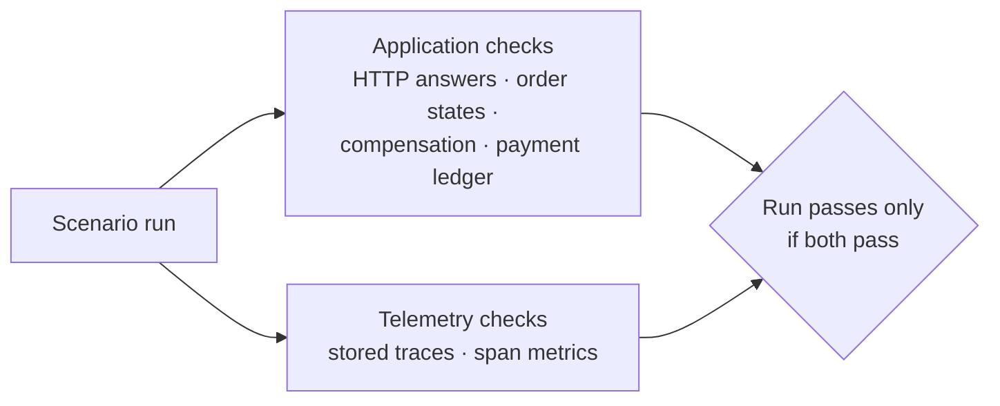

# Telemetry contracts

A dashboard that shows *something* is not the same as a dashboard that shows *the truth*. After
every experiment, the platform reads its own telemetry back — the stored traces and the span metrics
— and compares it with what really happened. The rules for this comparison are called **telemetry
contracts**. This document explains how they work, what each check means, and how the checks
themselves are tested.

---

## Two layers of evidence



| Layer | Source of truth | Defined in |
| --- | --- | --- |
| Application | The answers the runner received, the orders read back from OrderService, the payment ledger | The scenario file (`expect.application`) |
| Telemetry | Traces from the Jaeger API, counters from Prometheus | A contract function per scenario (`expect.telemetry.contract`) |

The application layer establishes **what happened**; the telemetry layer checks whether the
observability data **agrees**. A platform whose orders succeed but whose traces are incomplete,
mislabelled or missing fails its experiments.

## When the checks run

The traces of a run are not available immediately: the Collector waits 20 seconds before deciding
whether to keep a trace, then writes it to storage. Verification therefore starts **35 seconds after
the last request**, and then waits up to 60 seconds for each trace to contain all expected services.

Counter checks compare a snapshot taken **before** the first request with the value afterwards. They
wait for the next span-metrics flush and Prometheus scrape (15 seconds each); checks that assert
"no new errors" wait 45 seconds so that late spans are included.

A recorded run can be verified again at any time, for example after changing a contract:

```bash
uv run scenarioctl verify                # the latest run
uv run scenarioctl verify <run id>
```

## Finding the traces of a run

| Method | Used when |
| --- | --- |
| **By trace id** — every response carries a `traceresponse` header; the runner stores the trace id of each request | The scenario checks individual requests (most application-fault scenarios) |
| **By run id** — every span carries `scenario.run_id`; the runner searches Jaeger for spans of the run in the run's time window | The question is about the traffic as a whole, for example which pods served it (Kubernetes scenarios) |

Requests rejected at the gateway (413, 429) never reach OrderService and therefore carry no
`traceresponse`; the scenarios about them use metrics instead.

## Checks applied to every verified trace

| Check | Fails when |
| --- | --- |
| **Trace integrity** | The trace does not have exactly one root, the root is not Kong's span, or a span refers to a parent that does not exist |
| **Kubernetes metadata** | A .NET span lacks its namespace, pod, node or deployment, or a Kong span lacks its namespace |
| **Correlation** | OrderService's span does not carry the request's correlation id, run id and Kong request id; the transaction's `order.id` differs from the created order; or a dependency's span carries a different run id |
| **Sensitive data** | An attribute name looks like a credential, or the run's **canary** value appears in any attribute, event or resource attribute |

The canary is a fake API key (`X-Api-Key: canary-<run id>`) that the runner sends with every request.
No component should ever record it. If any layer — the services, Kong, or the Collector — started
recording request headers, the canary would appear in a stored span and this check would fail.

## Scenario-specific checks

| Check | Used by | Proves |
| --- | --- | --- |
| **Topology** | Most order scenarios | Every required service appears, forbidden services never appear, and the only calls between services are Kong → OrderService and OrderService → its four dependencies |
| **Stages** | Failure scenarios | The expected business and compensation steps ran, and the forbidden ones did not |
| **Stage order** | Most order scenarios | Inventory and fraud overlapped in time; payment started after both; shipping after payment; compensation after the failed step |
| **State events** | Most order scenarios | The `order.state_changed` events form exactly the expected path, and `order.state` holds its end |
| **Error marking** | Most order scenarios | The transaction is marked as an error for technical failures, and **not** for business rejections |
| **Retry attempts** | `payment-retry`, `payment-timeout`, `dependency-unavailable` | The attempts are numbered 1..*n*, there are *n* − 1 `retry` events, and `retry.count` is *n* − 1 |
| **Idempotent replay** | `payment-retry` | PaymentService recorded the authorization exactly once, and its last attempt was answered as a replay |
| **Latency attribution** | `slow-payment`, `payment-retry` | The slow step is the longest step, takes at least the given share of the transaction, and the trace really lasted that long |
| **Missing dependency visible** | `dependency-unavailable` | The shipping step is marked as a `timeout`, and no ShippingService span exists |
| **Pod attribution** | `pod-deletion`, `rolling-restart`, `readiness-loss`, `replica-degradation` | The pods named in the spans match what Kubernetes did: deleted and replacement pod, old pods first and new pods last, no traffic to the unready pod, slow spans only from the degraded pod |
| **Metric deltas** | `kong-rate-limit`, `oversized-request`, `auth-denied`, `traffic-spike`, `rolling-restart`, `readiness-loss` | Every rejection was counted exactly; no request passed where it should not; no error span appeared |
| **Pipeline health** | `traffic-spike`, `trace-storage-outage` | No spans refused and no traces dropped before their sampling decision; the storage queue held data but never filled up |
| **Outage visibility** | `collector-outage` | Requests made while the Collector was down have no OrderService spans — the outage really happened and is visible as a gap |

### Timing comparisons are clock-safe

Spans from different processes carry timestamps from different clocks. The checks that compare
timings inside one trace — stage order, latency attribution — therefore use only spans recorded by
the same process (OrderService's step spans). The pod-attribution checks, which order traffic across
pods, work at the scale of seconds, far above any clock difference between the cluster's nodes.

## Exact numbers, not "roughly"

Counter checks expect exact values: if the client received 76 answers with status 429, the metric
must have grown by exactly 76. That is possible because only one experiment runs at a time — each
holds a cluster-wide lock ([experiment-safety.md](experiment-safety.md)), so no other traffic changes
the counters meanwhile.

Where exactness is impossible, the check states its tolerance openly: the sampling rate, for
example, is verified against a statistical band rather than a fixed count
([sampling.md](sampling.md)).

## Findings that stay visible

Some findings are neither a pass nor a failure but must not disappear. They are recorded as
**notes** on the run and printed with its report:

```text
[ OK ] [telemetry] gateway span gap (known Kong 3.9 limitation): 3 trace(s): Kong answered a 5xx
       upstream response with a new balancer span, so OrderService's parent span id is never exported
[ OK ] [telemetry] storage queue peak: 12 of 200 batches
```

The gateway gap is a defect in Kong 3.9.3 ([gateway.md](gateway.md#known-defect-a-missing-parent-span-on-5xx-responses)).
The integrity check accepts it only for its exact pattern: Kong's single balancer span has an error
status and a 5xx answer, and the orphaned span is OrderService's server span for the same Kong
request. Any other missing parent still fails the run.

## The checks themselves are tested

A check that can never fail proves nothing. The trace checks are therefore unit-tested against
**traces recorded from real runs** (`automation/tests/fixtures/traces/`: a normal order, a retried
payment and a timed-out payment). Each test takes a real trace, breaks exactly one thing, and asserts
that the right check complains:

| Change to a real trace | Check that must fail |
| --- | --- |
| A span removed, or a second root added, or the root moved away from Kong | Integrity |
| A call added between two dependencies | Topology |
| Payment moved before the parallel checks finished; inventory and fraud made sequential | Stage order |
| A state event removed | State events |
| A business rejection marked as an error | Error marking |
| A fast trace checked against a 1-second latency threshold | Latency attribution |
| Attempt numbers changed | Retry attempts |
| A second `payment.authorization_recorded` event added | Idempotent replay (a double charge) |
| A pod name removed | Kubernetes metadata |
| A different correlation id | Correlation |
| The canary placed in an attribute, or a credential-like attribute name added | Sensitive data |
| The gateway gap presented without a failed upstream answer, or for another request | Integrity (the exception must not apply) |

On top of that, an end-to-end **negative control** runs ordinary successful orders and verifies them
against the `payment-retry` contract. The application checks pass, but the telemetry checks must fail
on the missing retry and the missing replay — proving that the verification pipeline as a whole can
still say "no" ([testing-strategy.md](testing-strategy.md)).

## Where the code lives

| File | Contents |
| --- | --- |
| `automation/src/txplatform/scenarios/contracts.py` | One contract function per scenario, the metric selectors, the timing constants |
| `automation/src/txplatform/scenarios/tracechecks.py` | The reusable, pure trace checks |
| `automation/src/txplatform/traces.py` | The trace model that the checks operate on, parsed from Jaeger's OTLP JSON |
| `automation/tests/unit/test_tracechecks.py` | The tests against recorded traces |

## Related documents

- [Scenario catalog](scenario-catalog.md) — which scenario uses which checks
- [Writing scenarios](writing-scenarios.md) — adding a contract
- [Tracing](tracing.md) — the attributes and events the checks read
- [Testing strategy](testing-strategy.md) — how contracts fit into the test layers
