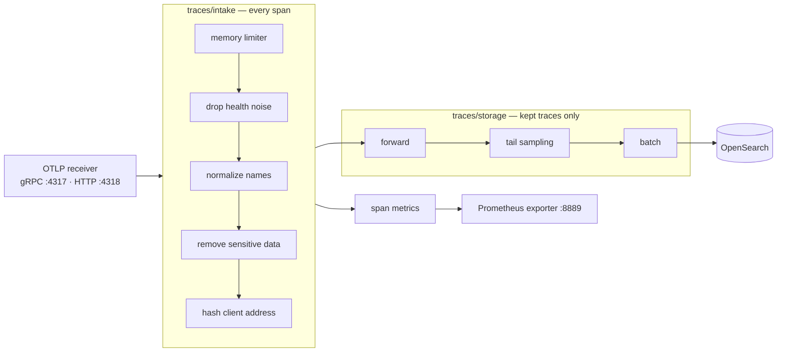

# Telemetry pipeline

Every span in the platform passes through one process: the **Jaeger Collector**. It removes noise
and sensitive data, turns spans into metrics, decides which traces are worth storing, and writes
them to OpenSearch. This document follows a span through the Collector and explains what happens
when a part of the pipeline fails.

Jaeger v2 is built on the OpenTelemetry Collector, so its configuration is an ordinary Collector
configuration: **receivers** accept data, **processors** change or filter it, **connectors** join
one pipeline to another, and **exporters** send data out.

---

## The pipeline at a glance



Two rules shape this layout:

| Rule | Why it matters |
| --- | --- |
| **Clean once, at the front.** Every span passes the same cleaning steps before anything else. | Metrics and stored traces see the same attribute names and the same redaction; there is no path around the cleaning. |
| **Count before sampling.** Span metrics are computed from every span, before any trace is dropped. | Request rates, error counts and latencies stay exact although about three quarters of ordinary traces are never stored ([metrics-and-monitoring.md](metrics-and-monitoring.md)). |

## Receiving spans

| Receiver | Port | Sent by | Notes |
| --- | --- | --- | --- |
| OTLP over gRPC | 4317 | the five .NET services | Exported every second by each service |
| OTLP over HTTP | 4318 | Kong | Kong's OpenTelemetry plugin supports only HTTP |

Network policies allow exactly these senders to reach these ports, so no other workload can inject
spans into the pipeline ([network-policies.md](network-policies.md)).

## Cleaning: five processors

The `traces/intake` pipeline runs every span through five processors, in this order.

### 1. Memory limiter

Refuses new data when the Collector approaches 80% of its 768 MiB memory limit (with 20% headroom
for sudden spikes). It runs first, so a flood of spans is pushed back to the senders instead of the
Collector being killed for using too much memory. Refused spans are counted in
`otelcol_receiver_refused_spans`.

### 2. Drop health noise

Health checks and metric scrapes carry no transaction information. The services already create no
spans for them ([tracing.md](tracing.md)); the Collector adds a second guard for any other source:

```yaml
- context: span
  conditions:
    - IsRootSpan() and IsMatch(span.attributes["url.path"], "^/(health|metrics)(/|$)")
```

Only **root** spans (spans without a parent) are dropped. Removing a span from the middle of a trace
would break the trace's parent-child chain and produce exactly the kind of broken trace the platform
is designed to detect.

### 3. Normalize attribute names

Kong still reports the older names `http.status_code` and `http.method`. They are copied to the
current OpenTelemetry names `http.response.status_code` and `http.request.method`, and the old names
are removed. Searches and metric dimensions therefore use one name for every service.

### 4. Remove sensitive data

| Action | Rule | Reason |
| --- | --- | --- |
| Delete attributes by name | any name matching `(?i)(authorization\|cookie\|password\|passwd\|secret\|token\|api[._-]?key\|card[._-]?number)` | Credentials and card data must never be stored, whichever library recorded them |
| Reduce full URLs to their path | `http.url` and `url.full` become `url.path`; `url.query` is deleted | A query string can carry a token (`?access_token=…`) |

### 5. Hash the client address

On Kong's `kong` span, `http.client_ip` and `net.peer.ip` are replaced by their SHA-256 hash. The
same caller still produces the same value, so requests can be grouped by caller, but the address
itself is not stored.

This is **pseudonymization, not anonymization**: an IPv4 address can be recovered by hashing all
four billion possible addresses. A production system would shorten the address or use a keyed hash
([production-considerations.md](production-considerations.md)).

## Counting: span metrics

The `span_metrics` connector turns every span into three measurements — calls, errors and duration
— per service and operation. Prometheus scrapes them from port 8889 every 15 seconds, and Jaeger's
Monitor tab reads them from Prometheus. How the metrics are shaped and used is described in
[metrics-and-monitoring.md](metrics-and-monitoring.md).

## Deciding: tail sampling

The `forward` connector hands every cleaned span to the `traces/storage` pipeline, where tail
sampling waits 20 seconds after a trace's first span and then decides whether the whole trace is
stored. Errors, slow traces and debug-flagged traces are always kept; 25% of the rest are kept as a
representative sample ([sampling.md](sampling.md)).

## Storing: export to OpenSearch

Kept traces are batched and written to OpenSearch through Jaeger's storage exporter. Three settings
make the export survive a storage outage without losing data or exhausting memory:

| Setting | Value | Effect |
| --- | --- | --- |
| Write mode | synchronous (`write_mode: sync`) | Each batch is written with one blocking bulk request, so a failed write is reported to the exporter instead of disappearing inside a client-side buffer |
| Retries | first after 5 s, then growing to at most 30 s, for up to 5 minutes | A short outage delays traces instead of losing them |
| Queue | 200 batches, 4 writers | Batches wait here during an outage; when the queue is full, new batches are dropped and counted rather than growing until the Collector runs out of memory |

The `trace-storage-outage` scenario scales OpenSearch to zero for about a minute while orders keep
flowing. Measured: all 15 traces from the outage arrived complete after recovery, and the queue
peaked at **12 of 200** batches.

## When part of the pipeline fails

| Failure | Orders | Telemetry | Verified by |
| --- | --- | --- | --- |
| Collector unavailable | Unaffected — export runs in the background and never blocks a request | Spans produced during the outage are lost | `collector-outage` scenario: 40 of 40 orders completed, and the missing spans are asserted |
| OpenSearch unavailable | Unaffected | Kept traces wait in the queue and are written after recovery | `trace-storage-outage` scenario |
| Jaeger Query unavailable | Unaffected | Ingestion and storage continue; only the UI is gone | `observability-resilience` suite |
| More new traces than the sampling buffer holds | Unaffected | The oldest undecided traces are dropped and counted; the Collector keeps running | `recovery` suite |
| Collector near its memory limit | Unaffected | New spans are refused and counted | Self-metrics below |

The first row reflects a deliberate priority: **telemetry must never take the business down with
it.** A missing trace is a visible, counted gap; a failed order is lost revenue.

## The pipeline watches itself

The Collector publishes its own metrics on port 8888, and Prometheus stores them. These are the
numbers that reveal a pipeline in trouble:

| Metric | A rising value means |
| --- | --- |
| `otelcol_receiver_accepted_spans` | Spans are arriving (expected to rise steadily) |
| `otelcol_receiver_refused_spans` | The memory limiter is turning data away |
| `otelcol_exporter_send_failed_spans` | Writes to OpenSearch are failing |
| `otelcol_exporter_queue_size` (against `otelcol_exporter_queue_capacity`) | A storage backlog is building up |
| `otelcol_processor_tail_sampling_sampling_trace_dropped_too_early` | The sampling buffer is too small for the traffic |
| `otelcol_processor_tail_sampling_count_traces_sampled` | Decisions per policy (`policy`, `sampled` labels) |

The validation suites and several scenarios read these metrics and fail if refusals, export
failures or early drops appear when they should not ([validation-suites.md](validation-suites.md)).

## One Collector on purpose

Tail sampling can only judge a trace when all of its spans are in the same process. The Collector
therefore runs as **one replica** with the `Recreate` update strategy: during a rollout the old pod
stops before the new one starts, so two Collectors never split a trace between them.

The cost is a short gap in telemetry during a Collector restart, and a single point where all spans
converge. The production answer is a two-tier design: a first layer of Collectors that routes spans
by trace id (a load-balancing exporter) to a second layer of sampling Collectors
([production-considerations.md](production-considerations.md)).

## Configuration

| What | Where |
| --- | --- |
| The pipeline (receivers, processors, connectors, exporters) | `deploy/charts/observability/templates/_configs.tpl` |
| Sampling numbers, resources, image versions | `deploy/charts/observability/values.yaml` |

The rendered configuration is stored in the ConfigMap `jaeger-collector-config`. A checksum of it is
written onto the pod template, so any configuration change restarts the Collector automatically
when the component is redeployed.

## What is verified

The `telemetry-pipeline` suite sends synthetic spans with exactly chosen properties — errors, slow
spans, debug flags, health paths, secrets in attributes and URLs — plus real gateway traffic, waits
for the sampling decision, and then inspects what was stored and counted:

| Check | What it proves |
| --- | --- |
| Error, slow and debug traces are always kept | The retention policies work |
| Normal traces are kept at the baseline rate | The 25% sample is statistically correct |
| Span metrics count every span, including dropped traces | Metrics are computed before sampling |
| Late spans join traces that were already kept | The decision cache works |
| Health spans are filtered without breaking traces | Noise filtering is safe |
| Sensitive attributes are removed and client addresses hashed | Redaction works on real and synthetic data |
| Kong's legacy HTTP status becomes the standard metric dimension | Normalization works |
| Span metrics carry no high-cardinality identifiers | The metric series stay bounded |
| Jaeger's Monitor API returns RED metrics for real services | The metrics reach Jaeger |
| Collector self-metrics show healthy sampling and ingestion | Nothing is dropped silently |

## Related documents

- [Tracing](tracing.md) — how spans are produced before they reach the Collector
- [Sampling](sampling.md) — the tail-sampling policies in detail
- [Metrics and monitoring](metrics-and-monitoring.md) — what the span metrics are used for
- [Trace storage](trace-storage.md) — OpenSearch, indices and retention
