# Trace storage

Kept traces are stored in OpenSearch and served by Jaeger Query. This document describes how the
storage is laid out, how old data is removed, how traces are read back — by people and by the
automation — and how the storage behaves when one of its parts fails.

---

## Components

```mermaid
flowchart LR
    coll["Jaeger Collector"] -->|"bulk writes"| os[("OpenSearch<br/>one node · 5 GiB volume")]
    query["Jaeger Query<br/>UI and API"] -->|"searches"| os
    query -->|"span metrics"| prom[("Prometheus")]
    cleaner["jaeger-index-cleaner<br/>nightly CronJob"] -->|"deletes old indices"| os
    user(["Operator or automation"]) -->|"port-forward :16686"| query
```



| Component | Kind | Role |
| --- | --- | --- |
| `opensearch-traces` | StatefulSet, 1 pod | Stores spans and the list of services and operations |
| `jaeger-collector` | Deployment, 1 pod | Writes kept traces ([telemetry-pipeline.md](telemetry-pipeline.md)) |
| `jaeger-query` | Deployment, 1 pod | Serves the Jaeger UI and APIs; reads traces from OpenSearch and span metrics from Prometheus |
| `jaeger-index-cleaner` | CronJob | Deletes indices older than the retention period |

The Collector and Query run the same Jaeger image but are **separate deployments**. Either can fail
or restart without affecting the other: stored traces remain searchable while the Collector is down,
and ingestion continues while Query is down. The `observability-resilience` suite verifies both.

## How traces are organized

Jaeger writes into **one index per day** (an index is OpenSearch's unit of storage, comparable to a
table). All names start with the prefix `txplatform`:

```text
txplatform-jaeger-span-2026-09-18      the spans
txplatform-jaeger-service-2026-09-18   service and operation names, for the search form
```

The configuration also defines daily indices for service dependencies and adaptive sampling, but no
component writes to them, so they are never created.

| Index setting | Value | Reason |
| --- | --- | --- |
| Shards | 1 | One node needs no data distribution |
| Replicas | 0 | A single node cannot hold a copy of its own data |
| Rollover | daily | Retention deletes whole days; deleting an index frees its space immediately, deleting documents inside an index does not |

Writes are synchronous: each batch is one blocking bulk request, so the Collector learns about a
failed write and retries it ([telemetry-pipeline.md](telemetry-pipeline.md#storing-export-to-opensearch)).

For scale: a full day of running every experiment several times used about 21 MB of disk.

## Retention

A CronJob runs Jaeger's index cleaner every night at 23:55 (cluster time, UTC) and deletes indices
older than **2 days**:

| Setting | Value |
| --- | --- |
| Schedule | `55 23 * * *` |
| Retention | `retentionDays: 2` in `deploy/charts/observability/values.yaml` |
| Index prefix | `txplatform` — indices with other prefixes are never touched |
| Overlapping runs | Forbidden |

The cleaner chooses indices by their **creation time**, not by the date in their name. An index
cannot be made to look old by renaming it, which is also why the check below does not try to.

**How retention is verified.** Waiting two days is not a practical test. The `observability` suite
therefore creates an index under a throwaway prefix, runs the real CronJob's job template once with
that prefix and zero days of retention, and confirms that the throwaway index is gone while
today's platform index is untouched. This proves network access, index matching and deletion
without risking real data.

## OpenSearch settings

OpenSearch is configured to fit on one workstation next to everything else:

| Setting | Value | Reason |
| --- | --- | --- |
| Nodes | 1 | Enough for experiments; memory use stays predictable |
| Java heap / memory limit | 768 MiB / 1.5 GiB | OpenSearch needs memory beyond its heap for file caches |
| Volume | 5 GiB, kind's default storage class | Data survives pod restarts |
| `node.store.allow_mmap` | `false` | Avoids having to raise the kernel setting `vm.max_map_count` inside the Docker VM |
| Security plugin | disabled | No users or TLS; the network policy that lets only the Collector, Query and the cleaner connect is the boundary |
| Root helper container | disabled | The chart's file-ownership helper would run as root, which the namespace's restricted Pod Security level forbids; kind's volumes do not need it |
| Readiness | `GET /_cluster/health?local=true` | The pod is ready only when the node has a usable cluster state, not merely an open port |

## Reading traces

### In the browser

```bash
uv run platformctl ui jaeger   # opens a port-forward; then browse http://127.0.0.1:16686
```

| UI feature | State | Reason |
| --- | --- | --- |
| Search and trace view | enabled | The main way to explore traces |
| Critical path | enabled | Highlights the spans that determined the total duration |
| Monitor tab | enabled | Request rate, errors and latency from Prometheus ([metrics-and-monitoring.md](metrics-and-monitoring.md)) |
| Dependencies (service graph) | hidden | Requires a separate batch job that the platform does not run |
| Archive | disabled | There is no second storage for long-term traces |

Useful searches:

| Goal | Search |
| --- | --- |
| All traces of one experiment run | Service `order-service`, Tags `scenario.run_id=<run id>` |
| One request by correlation id | Service `order-service`, Tags `correlation.id=<id>` |
| All failed orders | Service `order-service`, Tags `error=true` |
| Slow orders | Service `order-service`, Min Duration `1s` |

### Through the API

The automation reads traces through Jaeger's **API v3**, whose responses use the OpenTelemetry (OTLP)
JSON format:

| Purpose | Request |
| --- | --- |
| One trace | `GET /api/v3/traces/{traceId}` |
| Search | `GET /api/v3/traces?query.serviceName=order-service&query.startTimeMin=<RFC 3339>&query.startTimeMax=<RFC 3339>&query.attributes={"scenario.run_id":"<id>"}&query.searchDepth=1000` |
| Services | `GET /api/v3/services` |
| Operations | `GET /api/v3/operations?service=order-service` |

The automation converts these responses into a small trace model (`automation/src/txplatform/traces.py`)
on which the trace checks operate ([telemetry-contracts.md](telemetry-contracts.md)).

## When storage components fail

| Failure | What happens | Verified by |
| --- | --- | --- |
| OpenSearch pod restarts | Stored traces survive on the volume; a trace stored before the restart is served complete afterwards | `observability-resilience` suite |
| OpenSearch unavailable for about a minute | The Collector holds kept traces in its queue and writes them after recovery; orders are unaffected | `trace-storage-outage` scenario: all 15 traces arrived; queue peak 12 of 200 batches |
| Jaeger Query unavailable | Nothing is lost; only the UI and API are gone until it returns | `observability-resilience` suite |
| Jaeger Collector unavailable | Stored traces remain searchable through Query | `observability-resilience` suite |

## Limits

| Limit | Consequence |
| --- | --- |
| One OpenSearch node, no replicas | Losing the volume loses all stored traces |
| No authentication or TLS on OpenSearch | Any workload that the network policy admitted could read or delete traces |
| Two days of retention, no archive | Older traces are gone; re-running a scenario is the way to reproduce evidence |
| Data lives inside the kind node containers | `platformctl destroy` deletes all traces |

Production counterparts are described in
[production-considerations.md](production-considerations.md).

## Related documents

- [Telemetry pipeline](telemetry-pipeline.md) — how traces reach storage
- [Sampling](sampling.md) — which traces are stored at all
- [Metrics and monitoring](metrics-and-monitoring.md) — the Monitor tab's data source
- [Walkthrough](walkthrough.md) — finding and reading a trace in the UI
