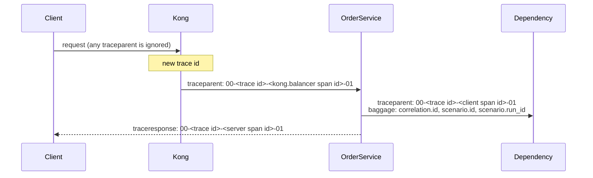

# Tracing

A **trace** is the complete record of one request as it travels through the system: a tree of timed
operations called **spans**. This document explains how each request becomes one trace, what every
span carries, which rules keep traces trustworthy, and what is deliberately never recorded.

---

## The anatomy of one order's trace

A successful order produces sixteen spans from six services:

```text
kong                                SERVER    kong-gateway        request received at the edge
└─ kong.balancer                    CLIENT    kong-gateway        call to the upstream
   └─ POST /orders                  SERVER    order-service       the API request
      └─ order.transaction          INTERNAL  order-service       the business transaction
         ├─ inventory.reserve       INTERNAL  order-service       business step
         │  └─ POST                 CLIENT    order-service       one HTTP attempt
         │     └─ POST /inventory/reservations   SERVER   inventory-service
         ├─ fraud.evaluate          INTERNAL  order-service
         │  └─ POST                 CLIENT    order-service
         │     └─ POST /fraud/evaluations        SERVER   fraud-service
         ├─ payment.authorize       INTERNAL  order-service
         │  └─ POST                 CLIENT    order-service
         │     └─ POST /payments/authorizations  SERVER   payment-service
         └─ shipping.create         INTERNAL  order-service
            └─ POST                 CLIENT    order-service
               └─ POST /shipments                SERVER   shipping-service
```

The tree has three layers on purpose:

| Layer | Spans | Answers |
| --- | --- | --- |
| Business | `order.transaction` and the four step spans | *What was the platform doing?* |
| Attempts | one `POST` client span per HTTP attempt | *How often did it have to try?* |
| Dependencies | the dependencies' server spans | *Which pod did the work, and how long did it take there?* |

This separation is what lets a trace answer a question like "was payment slow because
PaymentService was slow, or because OrderService retried three times?". Failed orders add
compensation spans (`compensation.payment.void`, `compensation.inventory.release`); retried steps
add one client span per attempt ([transaction-flow.md](transaction-flow.md)).

## Where the spans come from

| Source | Spans | How |
| --- | --- | --- |
| Kong | `kong`, `kong.balancer` | Kong's OpenTelemetry plugin, exported over OTLP/HTTP |
| ASP.NET Core in each service | Server spans (`POST /orders`, …) | OpenTelemetry's ASP.NET Core instrumentation |
| HttpClient in OrderService | Client spans (`POST`) | OpenTelemetry's HttpClient instrumentation, one span per attempt |
| OrderService's domain code | `order.transaction`, step and compensation spans | An `ActivitySource` named `OrderService.Transaction` |

The .NET services export over OTLP/gRPC and flush finished spans every second, so the Collector
receives a request's spans promptly — which matters because it decides about a trace 20 seconds after
its first span arrives ([sampling.md](sampling.md)).

## How the pieces join into one trace

Spans from different processes join the same trace because each hop passes the **trace context**
along: the W3C `traceparent` header, which carries the trace id and the id of the calling span.



### The trace always starts at the gateway

Kong ignores any trace context a client sends and removes incoming `tracestate` and `baggage`
headers. Every trace therefore has exactly one root — Kong's `kong` span — and nobody outside the
platform can choose a trace id, join someone else's trace, or flag their own traffic for retention
([gateway.md](gateway.md)).

### Baggage: an allow-list of three values

**Baggage** is a set of values that travel with the request, next to the trace context. The platform
uses it for exactly three ids:

| Baggage key | Comes from | Purpose |
| --- | --- | --- |
| `correlation.id` | the `X-Correlation-ID` header (generated by Kong when missing) | Find every span of one request by a human-friendly id |
| `scenario.id` | the `X-Scenario-Id` header | Find every span of one experiment type |
| `scenario.run_id` | the `X-Scenario-Run-Id` header | Find every span of one experiment run; scope fault rules to it |

OrderService is the **correlation boundary**: it discards any baggage a caller sent and sets only
values it validated itself (letters, digits and `. _ : -`, at most 128 characters). A span processor
in every service copies exactly these three keys onto every span it starts, so a single search finds
all spans of a request or of an experiment. Without the boundary, any caller could attach arbitrary
attributes to every span in the platform.

### What the caller gets back

Every response carries the headers that link a user's report to its telemetry:

| Header | Contents |
| --- | --- |
| `traceresponse` | `00-<trace id>-<span id>-<flags>` — the trace id opens the trace in Jaeger |
| `X-Correlation-ID` | The request's correlation id |
| `X-Kong-Request-Id` | Kong's request id, also recorded on OrderService's span as `kong.request.id` |

Error responses additionally contain a `traceId` field in their body.

## Where a span came from: resource attributes

Every span carries attributes describing the process that produced it. For the .NET services they
are set through the Kubernetes Downward API, so no service needs access to the Kubernetes API:

| Attribute | Example |
| --- | --- |
| `service.name` | `order-service` |
| `service.version` | `0f3b63a2300a` (the image's content hash) |
| `service.namespace` | `txplatform` |
| `service.instance.id` | the pod's UID |
| `deployment.environment.name` | `local` |
| `k8s.namespace.name` | `transaction-platform` |
| `k8s.deployment.name` | `order-service` |
| `k8s.pod.name` | `order-service-58cf884f8d-m7h89` |
| `k8s.pod.uid` | the pod's UID |
| `k8s.node.name` | `txplatform-worker` |

These are what make pod-level questions answerable from a trace — which replica was slow, which pod
served a request before a rolling restart, which pod was deleted. Kong's spans carry the service,
namespace and deployment, but no pod name: its plugin configuration is static and cannot know which
pod it runs in.

## Span attributes and events

Attribute names follow the OpenTelemetry semantic conventions wherever one exists
(`http.request.method`, `http.response.status_code`, `http.route`, `url.path`, `server.address`).
The platform's own names are defined once, in `TelemetryConventions.cs`, so services cannot drift
apart:

| Attribute | Where | Meaning |
| --- | --- | --- |
| `order.id`, `order.item_count`, `order.state` | transaction and step spans | Which order, how large, how it ended |
| `correlation.id`, `scenario.id`, `scenario.run_id` | every span | Correlation (from baggage) |
| `kong.request.id` | OrderService's server span | Kong's id for the request |
| `retry.attempt` | client spans | Attempt number (1, 2, 3…) |
| `retry.count` | step spans | How many retries the step needed |
| `payment.attempt`, `payment.idempotent_replay` | PaymentService spans | Which attempt arrived, and whether it was answered from the stored result |
| `payment.decision`, `fraud.decision`, `fraud.rule`, `fraud.risk_score` | dependency spans | Business outcomes |
| `failure.stage`, `failure.kind`, `failure.reason` | transaction and failed step | Why the transaction failed |
| `error.type` | transaction and failed step | Set with an error status, only for technical failures |
| `failure.injected`, `simulation.mode`, `fault.rule.id` | the span where a fault applied | This behavior was simulated ([fault-injection.md](fault-injection.md)) |
| `sampling.debug` | OrderService's server span | The caller asked for this trace to be kept |

| Event | Where | Attributes |
| --- | --- | --- |
| `order.state_changed` | `order.transaction` | `order.state.from`, `order.state.to` |
| `retry` | step span | `retry.failed_attempt`, `retry.delay_ms`, `retry.reason` |
| `circuit.state_changed` | step span | `circuit.dependency`, `circuit.state` (`open`, `half_open`, `closed`) |
| `compensation.completed`, `compensation.failed` | `order.transaction` | `compensation.action`, `compensation.detail` |
| `fault.applied` | the span where a fault applied | `fault.mode`, `fault.phase`, `fault.outcome`, `fault.delay_ms`, `fault.status_code` |
| `payment.authorization_recorded` | PaymentService's server span | – (the payment was written to the ledger) |
| `payment.idempotent_replay` | PaymentService's server span | – (the stored answer was returned) |

State changes are events rather than spans on purpose: an order shows every step of its history
while staying at about sixteen spans.

## Errors are marked only for technical failures

A span's status is set to **error** for timeouts, unavailable dependencies and server errors — and
**not** for business rejections such as insufficient stock or a declined card. A refused order is a
normal outcome, and marking it red would teach operators to ignore red. The trace checks verify this
rule in every scenario ([telemetry-contracts.md](telemetry-contracts.md)).

## Keeping a trace on request

Ordinary traces are sampled ([sampling.md](sampling.md)). A caller holding the `traces.debug`
permission can send `X-Debug-Trace: true`; OrderService then sets `sampling.debug = true` on its
server span, and the Collector keeps the whole trace. The experiments use this to make their
verification independent of sampling; without the permission the header is ignored.

## What is never recorded

| Not recorded | Why |
| --- | --- |
| Spans for health and management endpoints | Probes run every few seconds and carry no transaction information; they are excluded in the services, and the Collector additionally drops any parentless health span |
| Request and response bodies | They can contain personal or payment data |
| Request and response headers | They can contain credentials |
| The caller's IP address on service spans | Personal data; removed at the source |

On Kong's span the caller's address is kept only as a SHA-256 hash, and the Collector deletes any
attribute whose name suggests a credential ([telemetry-pipeline.md](telemetry-pipeline.md)).

## Sampling inside the services

The services record and export **every** span (a parent-based "always on" sampler). No service
decides whether a trace is kept; the Collector does, once all spans of the trace have arrived. The
services therefore need no sampling configuration, and no service can make a decision that
contradicts another.

## Logs link back to traces

The services write JSON logs, and every log line written while handling a request carries its
`TraceId` and `SpanId`. A log line can therefore be tied to its trace, and a trace to its log lines:

```json
{"LogLevel":"Information","Message":"Order 01a0b3d0-… finished in state Completed",
 "Scopes":[{"SpanId":"aca58c08bcb09779","TraceId":"cf99c80b5902e0264ffef31f08adc686"}, …]}
```

## What is verified

- The `tracing` suite sends a real order and checks that its trace reaches Jaeger with all five
  services, that every span's pod and node match the live pods, and that no health-probe operation
  appears in Jaeger.
- The `edge` suite checks that Kong is the root of every trace and ignores client trace context.
- Every scenario checks trace integrity, Kubernetes metadata, correlation ids and the absence of
  sensitive data ([telemetry-contracts.md](telemetry-contracts.md)).

## Related documents

- [Telemetry pipeline](telemetry-pipeline.md) — what happens to spans after they leave the services
- [Sampling](sampling.md) — which traces are stored
- [Transaction flow](transaction-flow.md) — the business meaning of the spans
- [Walkthrough](walkthrough.md) — reading a real trace step by step
