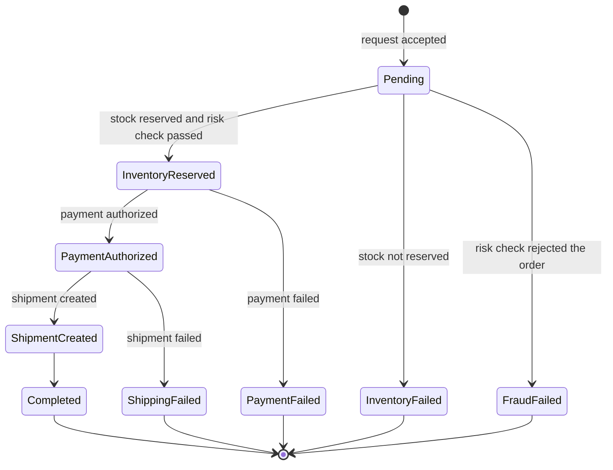
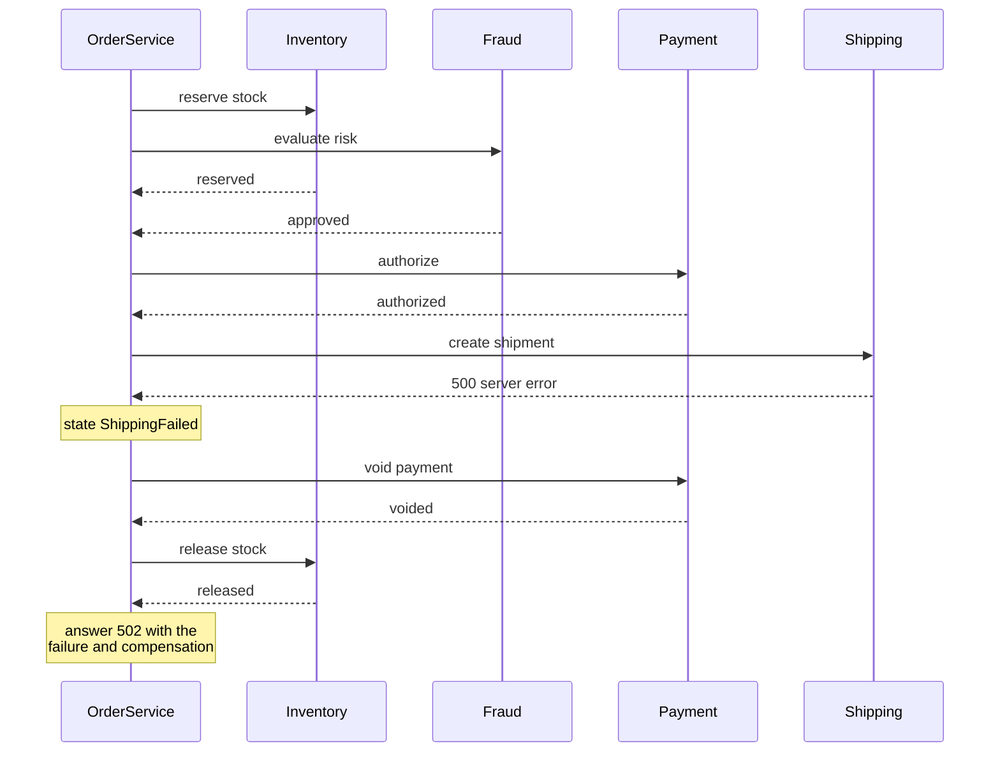

# Transaction flow

Placing an order runs a small distributed transaction across four services. There is no database
transaction that spans them, so OrderService coordinates the steps itself and, when something fails,
undoes what was already done. This document describes that process: the states an order passes
through, how failures are classified, what is undone, and how all of it appears in the trace.

---

## The order's life cycle



| State | Meaning |
| --- | --- |
| `Pending` | The request was valid and the order exists; nothing has happened in other services yet |
| `InventoryReserved` | Stock is reserved **and** the fraud check passed |
| `PaymentAuthorized` | The payment is authorized |
| `ShipmentCreated` | The shipment exists |
| `Completed` | Final: the order succeeded |
| `InventoryFailed`, `FraudFailed`, `PaymentFailed`, `ShippingFailed` | Final: the named step failed; earlier steps were undone |

A state machine in the domain model enforces these transitions: an order can never skip a step or
leave a final state. Every transition is recorded as an `order.state_changed` event on the trace, so
the path an order took is always visible.

## The steps

1. **Inventory and fraud, at the same time.** Reserving stock and checking risk do not depend on each
   other, so OrderService starts both and waits for both. Running them concurrently shortens every
   order; the trace checks verify that the two steps really overlap. If both fail, the inventory
   failure is reported, so the same input always produces the same state.
2. **Payment.** Starts only after both checks succeeded. Every attempt carries the same
   `Idempotency-Key` (`order-<order id>-authorize`), so retrying can never charge twice
   ([resilience.md](resilience.md)).
3. **Shipping.** Runs last because a shipment is the step most expensive to undo in real life.
4. **Completion.** The order becomes `Completed` and the API answers 201.

### A time budget of its own

The whole transaction has a budget of **12 seconds** — enough for the slowest failing path (both
checks, three payment attempts and both undo calls). The budget is independent of the HTTP request:
if the client disconnects, the transaction still finishes and still undoes what it must. A
half-processed order that nobody cleans up is exactly the failure this avoids.

## How failures are classified

Every answer from a dependency — or the lack of one — is translated into one of four failure kinds.
The kind decides the order's HTTP status and whether the trace is marked as an error.

| Failure kind | Typical cause | Order status | Error in trace? |
| --- | --- | --- | --- |
| `business_rejection` | Out of stock, risk limit, declined card, restricted zone | **422** | **No** |
| `dependency_error` | The dependency answered with a 5xx status | **502** | Yes |
| `timeout` | Every attempt timed out, or the 12-second budget ran out | **504** | Yes |
| `unavailable` | The connection failed, or the circuit breaker is open | **503** | Yes |

The distinction between the first row and the others is deliberate. A correctly refused order is a
normal business outcome; painting it red would teach operators to ignore red. The telemetry checks
verify this rule in every scenario ([telemetry-contracts.md](telemetry-contracts.md)).

The rules each dependency applies — which SKU is out of stock, which amount is too risky, which test
card is declined — are listed in [services.md](services.md).

## What is undone after a failure

This undo logic is called **compensation**. It runs in reverse order of the original steps:

| Failed step | Compensation |
| --- | --- |
| Inventory — business rejection | Nothing: no stock was reserved |
| Inventory — technical failure | Release stock (a reservation may exist even though no answer arrived) |
| Fraud | Release stock |
| Payment — business rejection (declined) | Release stock |
| Payment — technical failure | Void payment, then release stock |
| Shipping | Void payment, then release stock |

Two principles are behind this table:

- **A technical failure is ambiguous.** When a call times out, the dependency may still have done the
  work. Undo calls are therefore sent anyway — they are idempotent, and "nothing to release" or
  "nothing to void" count as success.
- **A business rejection is not.** A dependency that said "no" did nothing, so there is nothing to
  undo at that step.

Here is the sequence for an order whose shipment fails:



Each compensation step is recorded on the order and returned to the caller:

```json
{
  "state": "ShippingFailed",
  "failure": { "stage": "shipping", "kind": "dependency_error", "reason": "http_500" },
  "compensation": [
    { "action": "VoidPayment", "status": "Succeeded", "detail": "done" },
    { "action": "ReleaseInventory", "status": "Succeeded", "detail": "done" }
  ]
}
```

If an undo call itself fails, the step is recorded with status `Failed` and a
`compensation.failed` event is added to the trace; the order's state does not change. That makes the
problem visible to an operator; retrying undo steps durably is a production concern
([production-considerations.md](production-considerations.md)).

## How the transaction appears in a trace

| Element | Where | Contents |
| --- | --- | --- |
| `order.transaction` span | OrderService | `order.id`, `order.item_count`, `order.state` |
| Stage spans | `inventory.reserve`, `fraud.evaluate`, `payment.authorize`, `shipping.create` | One per step; their children are the HTTP attempts |
| Compensation spans | `compensation.payment.void`, `compensation.inventory.release` | One per undo call |
| `order.state_changed` events | on `order.transaction` | `order.state.from`, `order.state.to` |
| Failure attributes | on `order.transaction` and the failed stage | `failure.stage`, `failure.kind`, `failure.reason` |
| Error status | on `order.transaction` and the failed stage | Only for technical failures, together with `error.type` |
| `retry` events | on the stage span | `retry.failed_attempt`, `retry.delay_ms`, `retry.reason` |
| `compensation.completed` / `compensation.failed` events | on `order.transaction` | `compensation.action`, `compensation.detail` |

For a timed-out payment, a trace therefore shows: the payment stage with three numbered attempts and
two `retry` events, the transition to `PaymentFailed`, the two compensation spans, and an error
status on the transaction and the payment stage — everything needed to understand the order without
reading a single log line.

## Guarantees and their limits

| Guarantee | Holds? |
| --- | --- |
| A payment is never authorized twice for one order | **Yes** — idempotency key plus a single PaymentService replica |
| Every failed order is compensated before the response is sent | **Yes**, for failures inside the transaction |
| Every compensation step succeeds | No — an undo call gets two attempts; if both fail, the failure is recorded, and nothing retries it later |
| An order survives an OrderService crash in the middle of a transaction | No — the transaction runs in memory; nothing resumes it |
| Orders survive an OrderService restart | No — orders are kept in memory |

The last three rows are the price of an in-process orchestrator without durable state. They are
listed with their production alternatives in [known-limitations.md](known-limitations.md) and
[production-considerations.md](production-considerations.md).

## Related documents

- [Services](services.md) — the business rules of each dependency
- [Resilience](resilience.md) — timeouts, retries and the circuit breaker around each step
- [API reference](api-reference.md) — the request and response formats
- [Tracing](tracing.md) — the span and attribute conventions
